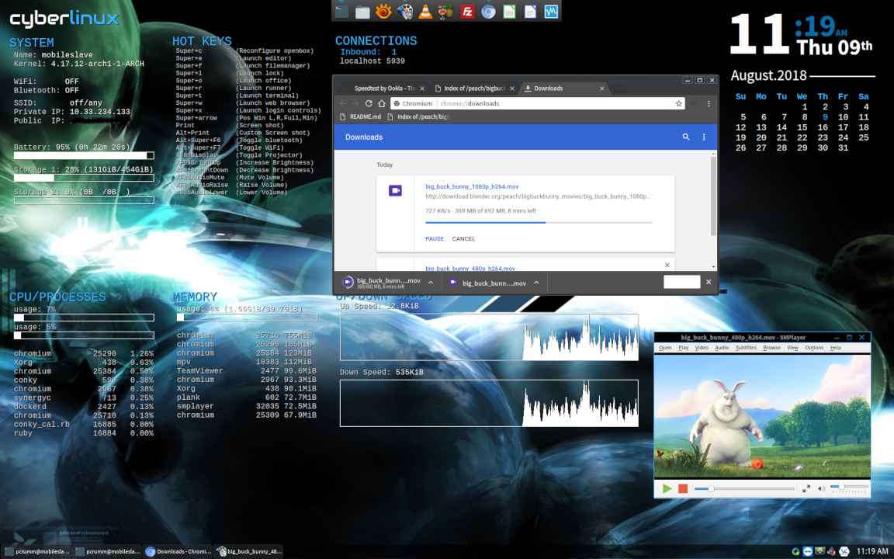

cyberlinux
[](https://travis-ci.com/phR0ze/cyberlinux)
[](https://coveralls.io/github/phR0ze/cyberlinux?branch=master)
[](https://opensource.org/licenses/MIT)
====================================================================================================


<b><i>cyberlinux</i></b> was designed to provide the unobtrusive beauty and power of Arch Linux as a
fully customized automated offline multi-deployment ISO. Leveraging Arch Linux's excellent packaging
system and some scripting cyberlinux is able to provide a completely customizable and automated
build of Arch Linux filesystems bundled as distinct deployment options on a BIOS/UEFI bootable ISO.
This includes opinionated builds of common use cases out of the box, but the option to build your own
infinitely flexible deployment is yours for the taking.

***Please fork this repo and create your own variations as you see fit.*** The profiles included by
default, though fully functional, are reference implementations only with highly opinionated designs
for my personal use cases. If you find the reference deployments useful note that any PRs, though
welcome, will be evaluated in that context and will need to align with my goals.

### Warning
The pre-built `cyberlinux-*` packages available in the [cyberlinux-repo](https://github.com/phR0ze/cyberlinux-repo)
are highly opinionated and in some cases will modify system configuration with cyberlinux defaults
and as such they are ***only recommended to be installed with new systems*** or to
***upgrade existing cyberlinux based systems*** and are
***not to be used directly on pre-existing non-cyberlinux systems***.

### Disclaimer
***cyberlinux*** comes with absolutely no guarantees or support of any kind. It is to be used at
your own risk. Any damages, issues, losses or problems caused by the use of ***cyberlinux*** are
strictly the responsiblity of the user and not the developer/creator of ***cyberlinux***.

<a href="docs/images/cyberlinux-deployment-01.jpg"></a>
<a href="docs/images/cyberlinux-deployment-02.jpg"></a>

### Quick Links
* [Help](docs)
* [Getting started](#getting-started)
  * [Prerequisites](#prerequisites)
    * [Arch Linux](#arch-linux)
    * [Ubuntu](#ubuntu)
  * [Create multiboot USB](#create-multiboot-usb)
    * [Build the ISO](#build-the-iso)
    * [Burn the ISO to USB](#burn-the-iso-to-usb)
    * [Test the USB in VirtualBox](#test-the-usb-in-virtualbox)
  * [Download cyberlinux ISO](#download-cyberlinux-iso)
* [Deploy cyberlinux](#deploy-cyberlinux)
  * [ACEPC AK1](docs/deployments/ACEPC-AK1.md)
  * [Dell XPS 13 9310](#Dell-xps-13-9310.md)
  * [HP ZBook 15](docs/deployments/HP-ZBook-15.md)
  * [Samsung Chromebook3 (CELES)](docs/deployments/Samsung-Chromebook3.md)
* [Advanced concepts](#advanced-concepts)
  * [cyberlinux help](#cyberlinux-help)
  * [Roll your own](profiles/README.md)
  * [cyberlinux-repo](docs/CYBERLINUX_REPO.md)
* [Background](#background)
  * [Evolution](#evolution)
  * [My take on Arch](#my-take-on-arch)
  * [Distro requirements](#distro-requirements)
* [Contributions](#contributions)
  * [Git-Hook Version Increment](#git-hook-version-increment)
* [Licenses](#licenses)
* [Backlog](#backlog)
* [Testlog](docs/CHANGELOG.md#Testlog)
* [Changelog](docs/CHANGELOG.md)

---

# Getting started <a name="getting-started"/></a>

## Prerequisites <a name="prerequisites"/></a>
The multiboot ISO is built almost entirely in a docker container with data cached on the local host
for quicker rebuilds. This makes it possible to build on systmes with a minimal dependencies. All
that is required is ***passwordless sudo***, ***jq***, and ***docker***. Optionally use Virtualbox or
another hypervisor solution to test out the resulting ISO/USB.

### Arch Linux <a name="arch-linux"/></a>
1. Passwordless sudo access is required for automation:
   ```bash
   $ sudo bash -c "echo '$USER ALL=(ALL) NOPASSWD: ALL' > /etc/sudoers.d/10-passwordless"
   ```
2. Install dependencies:
   ```bash
   $ sudo pacman -S jq docker virtualbox virtualbox-host-modules-arch
   $ sudo usermod -aG disk,docker,vboxusers $USER

   $ sudo systemctl enable docker
   $ sudo systemctl start docker
   ```
3. Add your user to the appropriate groups:
   ```bash
   $ sudo usermod -aG disk,docker,vboxusers $USER
   ```

### Ubuntu <a name="ubuntu"/></a>
1. Passwordless sudo access is required for automation:
   ```bash
   $ sudo bash -c "echo 'YOUR_USER ALL=(ALL) NOPASSWD: ALL' > /etc/sudoers.d/10-passwordless"
   ```
2. Install dependencies:
   ```bash
   $ sudo apt update
   $ sudo apt install jq docker virtualbox
   ```
3. Add your user to the appropriate groups:
   ```bash
   $ sudo usermod -aG disk,docker,vboxusers $USER
   ```

## Create multiboot USB <a name="create-multiboot-usb"/></a>
First ensure you satisfy the [Prerequisites](#prerequisites)

### Build the ISO <a name="build-the-iso"/></a>
1. Clone the repo:
   ```bash
   $ cd ~/Projects
   $ git clone git@github.com:phR0ze/cyberlinux
   ```
2. Execute the build:
   ```bash
   $ ./build.sh -p xfce -a
   ```

### Burn the ISO to USB <a name="burn-the-iso-to-usb"/></a>
1. Determine the correct USB device
   ```bash
   $ lsblk
   ```
2. Optionally wipe your USB first
   ```bash
   $ sudo wipefs --all --force /dev/sdd
   ```
3. Copy to the dev leaving off the partition
   ```bash
   $ sudo dd bs=32M if=temp/output/cyberlinux.iso of=/dev/sdd status=progress oflag=sync
   ```

### Test the USB in VirtualBox <a name="test-the-usb-in-virtualbox"/></a>
1. Determine which device is your USB
   ```bash
   $ lsblk
   ```
2. Create a raw vmdk boot stub from the USB
   ```
   $ sudo vboxmanage internalcommands createrawvmdk -filename usb.vmdk -rawdisk /dev/sdd
   RAW host disk access VMDK file usb.vmdk created successfully.

   # Change ownership of new image to your user
   $ sudo chown $USER: usb.vmdk

   # Add your user to the disk group
   $ sudo usermod -a -G disk $USER

   # Logout and back in and launch virtualbox
   ```
3. Create a new VM in VirtualBox  
   a. On the `Virtual Hard Disk` option choose `Use existing hard disk`  
   b. Browse to and select the `usb.vmdk` you just created  
   c. Start up the new VM  

# Download cyberlinux ISO <a name="download-cyberlinux-iso"/></a>
***cyberlinux*** ISOs are being hosted at https://osdn.net/projects/cyberlinux

# Deploy cyberlinux <a name="deploy-cyberlinux"/></a>
For the most part deploying ***cyberlinux*** is as simple as:
1. Booting from the USB or ISO you created in the [Create multiboot USB](#create-multiboot-usb) section
2. Selecting your desired deployment configuration
3. Walking through the simple installer wizard
4. Waiting for the install to complet
5. Removing the USB
6. Rebooting

## Advancecd concepts <a name="advanced-concepts"/></a>
* [cyberlinux help](#cyberlinux-help)
* [Roll your own](profiles/README.md)
* [cyberlinux-repo](docs/CYBERLINUX_REPO.md)

# Background <a name="background"></a>
***cyberlinux*** is an evolution of an idea come to fruition.  The origin was the need for an
automated installer that would be able to install a completely pre-configured and ready to use
system customized for a handful of common use cases (e.g. desktop, theater, server...) in an offline
environment. As time passed the need for simpler maintainability and access to larger more
up-to-date software repositories drove the search for the ideal Linux distribution.

### Evolution <a name="evolution"></a>

**Ubuntu Online Install**  
In the beginning I would deploy a super lightweight Ubuntu server system and then launch a custom
python script that would automate installing all packages and configuration settings I desired on
the new system.  This unfortunately required an internet connection and that my package sources,
many of which were outside Ubuntu's repositories, persist at the same location over an extended
period of time.  This method was slow, and fraught with network failures and missing online
packages as maintainers came and went.

**CentOS Offline Install**  
My next attempt was to use CentOS and Kickstart to develop an ISO with all the packages stored on
an ISO.  This solved my offline issues and gave a consistent versioning for packages, but still
took a long time to install and didn't allow for much in the way of pre-build or post install
configuration.  The crux of CentOS's issues was that it is notoriously behind the times and packages 
are difficult to find or simply don't exist. Additionally building newer packages on the old CentOS 
tool chains proved difficult and impossible in some cases where they required newer dependencies.

**Manjaro Offline Install**  
About this time I started looking for a distribution that provided modern packages and tooling and
found Arch.  Being intimidated by Arch's install process though, I moved on to Manjaro as the next
best thing and fell in love with ***manjaroiso*** and ***Thus*** as the means to develop my own
offline ISO with pre/post install configuration changes.  This seemed to solve most of my problems.
I now had offline install capabilities, latest versioned packages available and the ability to make
some small pre/post install changes.  However it didn't allow for custom applications for different
deployment options without heroic effort.  As time passed I found I was making more and more changes
to ***Thus***, the installer, and other installation aspects other than what was allowed for with
Manjaro's current tool set at the time. I soon realized that I had evolved my use of Manjaro so far
beyond its original purpose that consuming updates from upstream Manjaro and other tasks were
becoming complicated and tedious.  Additionally I was more and more envious of pure Arch Linux and
the goodness that was available by staying close to the source and began looking at Arch Linux
directly.

**Arch Offline Install**  
I really like Manjaro as per above and it took me far down the road I wanted to go. I began to
discover however that the parent distro, Arch Linux, had far greater market acceptance and thus more
community repositories and more pre-built AUR packages. I quickly found that the custom AUFS kernel
and different processes that Manjaro was using meant I couldn't leverage the greater Arch Linux
community packages easily. At this point I realized that I'd already moved far beyond the original
issue I had with Arch of no installer and so it was a natural progression to switch my distribution
from Manjaro to be based directly on Arch Linux. This made BlackArch and Antergos repos directly
available and put me in a bigger support community with newer updates and packages.

### My take on Arch <a name="my-take-on-arch"></a>
***Arch Linux kills!*** I've never used a distribution as transparent, clean and documented to use as 
Arch.  The packages are plentiful, up-to-date and easily managed. The community is huge and active, 
providing almost every package known to man in the Arch User Repository or you can easily build your 
own packages with little effort. The kernel and tooling is modern, maintenance is easy and rolling 
updates make for a system that can be used forever with little effort. Best of all though is that the 
Arch Install process provides simple building blocks that lend themselves easily to custom filesystem 
creations that in turn is readily turned into ISOs and other install media. Because of the large 
community and plethera of distros based off Arch there are many ideas to leverage such as the 
following:

**BlackArch** - https://blackarch.org  
BlackArch is a penetration testing distro based directly off Arch and is 100% compatible with Arch.
One of the main reasons I'm moving off Manjaro to pure Arch is to get access to BlackArch's
repository of penetration testing tools.

**Manjaro** - http://manjaro.org/get-manjaro  
Manjaro is an Arch split-off distro which used to have a really nice OpenBox deployment that suited
my needs quite well.  They have since dropped the OpenBox deployment but their distribution is still
one of the best distros out there and have a great community which adds to Arch's appeal with a
little adaptation. The main draw back with Manjaro is that that it can't leverage the Arch repos as
is due to their differences.

**ArchBang** - http://bbs.archbang.org  
ArchBang caught my eye because they are devoted to using lite components like OpenBox, LXTerminal,
VolumeIcon, LXAppearance, etc... They have a great community and a lot of good ideas and
configuration for keeping your system lite.

**Antergos** - http://antergos.com  
Antergos is based on Arch and 100% compatible but also has a few developments of its own, like its
slick custom isolinux boot and installer.  They also offer a number of prebuilt AUR packages in
their custom repos.

### Distro requirements <a name="distro-requirements"></a>
I boiled down my requirements for ***cyberlinux*** as follows:

* Single configuration file (i.e. profile) to drive ISO creation
* ISO must include all packages, config etc... (i.e. works offline)
* Boot splash screen shown with multi-deployment options
* Fast, simple automated installs with abosolute minimal initial user input
* Fully pre-configured user environments to avoid post-install changes
* Live boot option for maintenance, rescue and secure work
* Hardware boot and diagnostics options e.g. RAM validation
* As light as possible while still offering an elegant solution

# Contributions <a name="contributions"/></a>
Pull requests are always welcome.  However understand that they will be evaluated purely on whether
or not the change fits with my goals/ideals for the project.

## Git-Hook Version Increment <a name="git-hook-version-increment"/></a>
Enable the githooks to have automatic version increments

```bash
cd ~/Projects/cyberlinux
git config core.hooksPath .githooks
```

## Licenses <a name="licenses"/></a>
Because of the nature of ***cyberlinux*** any licensing will be of a mixed nature.  In some cases as
called out below such as ***reduce*** and the ***boot/initramfs/installer***, created by phR0ze, the
license is MIT. In other cases works i leveraged from else where using licenses such as GPLv2.

### ART work <a name="art-work"/></a>
All art work used in the distribution have been carefully selected to be either creative commons,
public domain, have permission from the original authors, or lay claim on fair use licensing. If for
some reason a licensing mistake has been made please let me know and I'll review the claim immediately.

### Configure, Build and Install Scripts <a name="configuration-build-install-scripts"/></a>
***reduce*** and all Ruby code related to it is licensed below via MIT additionally the
boot/initramfs/installer bash code base is likewise MIT licensed.

[LICENSE-MIT](LIENSE-MIT)

---

# Backlog <a name="backlog"/></a>
* rust: fungus new clone from github
  * use cyberlinux to drive the smallest slice of functionality
  * split out as features

* rust: clu wm xfce set desktop file monitor to use

* netbook: HDMI output
* netbook: added Cheese for webcam control
* netbook: boot on lid open

* installer: hanges when booting into the Graphical Target
  * just leave a message rather than autobooting
* Load networking in initramfs?

* desktop: added Zoom to the network menu
* desktop: vscode configs are not saved
* desktop: add utshushi menu entry
* desktop: add veracrypt
* Detect and install braswell config at install time
* Add slack to desktop
* Display time in installer using given timezone offset
* Document configuring Firefox
* GTK folder sort settings didn't take
* ACEPC
  * Need overscan, white line on right of monitor
  * Vulkan support
    * `sudo pacman -S vulkan-intel vulkan-tools`
    * `vulkaninfo` if you get info about your graphics card its working
* Add conflicts to PKGBUILD
* Replace powerline with powerline-go or powerline-rs
* devede and asunder icons in Paper are both the same?
* clu - cyberlinux automation
  * replace conky scripts, cal.rb, date.rb and radio.rb
  * build in skel copy for updates
* Add cyberlinux-repo README about packages and warnings and how to configure
  * Automate updates to the readme when updating the packages

<!-- 
vim: ts=2:sw=2:sts=2
-->
