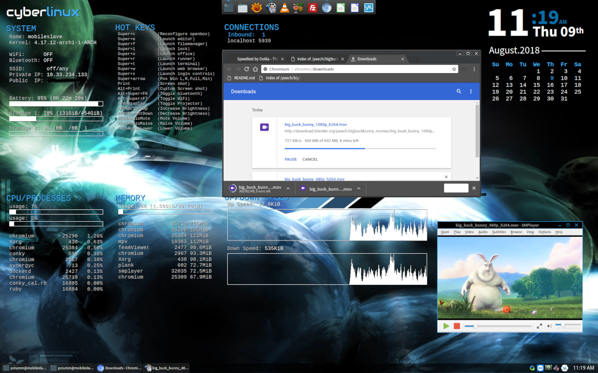
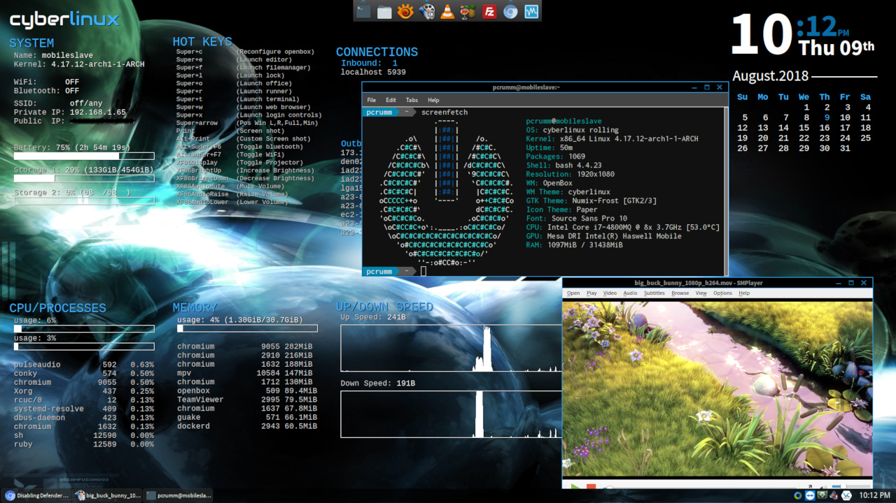

# cyberlinux

<b><i>cyberlinux</i></b> was designed to provide the unobtrusive beauty and power of Arch Linux as a fully
customized automated offline multi-deployment ISO. Using clean declarative yaml profiles,
cyberlinux is able to completely customize and automate the building of Arch Linux filesystems
which are bundled as a bootable ISO. Many common use cases are available as deployment options
right out of the box, but the option to build your own infinitely flexible deployment is yours
for the taking.

[](https://travis-ci.org/phR0ze/cyberlinux?branch=master)
[](https://coveralls.io/github/phR0ze/cyberlinux?branch=master&service=github)
[](https://opensource.org/licenses/MIT)

### Disclaimer
***cyberlinux*** comes with absolutely no guarantees or support of any kind. It is to be used at
your own risk.  Any damages, issues, losses or problems caused by the use of ***cyberlinux*** are
strictly the responsiblity of the user and not the developer/creator of ***cyberlinux***.

Additionally the pre-configured ***profiles*** and ***layers*** that exist in this repo are
purely for my own personal benefit and pull requests will be evaluated as such. I intend to make the
defaults generally useful but foremost it needs to be useful for my purposes. Pull requests aligning
with my desires will be accepted. Typically I would expect those looking to leverage this framework to
fork it and make their own configuration ***profiles***

### Table of Contents
* [Screen Shots](#screen-shots)
* [cyberlinux Profiles](#cyberlinux-profiles)
* [Deploy cyberlinux](#deploy-cyberlinux)
  * [Vagrant box deployment](#vagrant-box-deployment)
  * [Virtual box deployment](#virtual-box-deployment)
  * [Bare metal deployment](#bare-metal-deployment)
  * [Brown field deployment](#brown-field-deployment)
* [Configure cyberlinux](#configure-cyberlinux)
  * [Configure Proxy](#configure-proxy)
    * [Enable Proxy](#enable-proxy)
    * [Disable Proxy](#disable-proxy)
  * [Configure Backlight](#configure-backlight)
    * [HP ZBook 15 Display](#hp-zbook-15-display)
  * [Toggle Devices](#toggle-devices)
* [Roll your own cyberlinux](#build-cyberlinux)
* [Background](#background)
  * [Evolution](#evolution)
  * [My take on Arch](#my-take-on-arch)
  * [Distro requirements](#distro-requirements)
* [Contributions](#contributions)
  * [Git-Hook Version Increment](#git-hook-version-increment)
* [Licenses](#licenses)
* [cyberlinux help](#cyberlinux-help)

# Screen Shots <a name="screen-shots"/></a>
<a href="doc/images/cyberlinux-deployment-01.jpg"></a>
<a href="doc/images/cyberlinux-deployment-02.jpg"></a>

# cyberlinux Profiles <a name="cyberlinux-profiles"/></a>
[cyberlinux Profiles](profiles/README.md) provide a way to capture predefined system configurations
and turn them into ISO and Vagrant Box artifacts.  There are serveral predefined profiles to choose
from and the possibility of making endless more.

# Deploy cyberlinux <a name="deploy-cyberlinux"/></a>
***cyberlinux*** can be quickly deployed using the ***Bare metal***, a hypervisor like
***VirtualBox*** or via prebuilt ***Vagrant boxes***. Simply choose the pre-built artifact of your
choice either ***ISO*** or ***Vagrant Box*** and deploy at will. Additionally you could roll your
own artifacts usig [cyberlinux profiles](profiles/README.md).

## Vagrant box deployment <a name="vagrant-box-deployment"/></a>
Deploy [phR0ze/cyberlinux-standard-desktop](https://app.vagrantup.com/phR0ze/boxes/cyberlinux-standard-desktop) via a VM using a Vagrant Box

```bash
# Create a Vagrantfile describing the cyberlinux-desktop box to use
vagrant init phR0ze/cyberlinux-standard-desktop

# Download and deploy cyberlinux-standard-desktop box
vagrant up
```

## Virtual box deployment <a name="virtual-box-deployment"/></a>
Deploy ***cyberlinux*** via a VM using Virtual Box

1. Create a VM named ***cyberlinux-desktop*** with ***4GB RAM, 40GB HDD***  
2. Once created edit ***Settings***  
  a. Set ***System >Processor = 4***  
  b. Set ***Display >Video = 32***  
  c. Set ***Network >Bridged Adapter***  
  d. Set ***Storage >IDE Empty*** to ***cyberlinux-standard-0.2.208-4.18.1-x86_64.iso***  
  e. Click ***OK***  
2.	Once booted to the ISO choose the ***cyberlinux-desktop*** deployment option

## Bare metal deployment <a name="bare-metal-deployment"/></a>
Deploy ***cyberlinux*** via a USB directly onto a machine

1. Download the latest [***cyberlinux ISO***](https://github.com/phR0ze/cyberlinux/releases)
2. Burn the ISO to a USB via ***dd***  
    ```bash
    # Determine correct USB device
    sudo fdisk -l

    # Burn to USB
    sudo dd bs=4M if=~/cyberlinux-standard-0.2.208-4.18.1-x86_64.iso of=/dev/sdb status=progress oflag=sync
    ```
2. Burn the ISO to a USB via ***MultiWriter***  
    ```bash
    # Install MultiWriter
    sudo pacman -S gnome-multi-writer

    # Launch MultiWriter
    sudo gnome-multi-writer

    # Add the ISO and point it at your USB and click start  
    ```
3. Burn the ISO to a DVD via ***GrowISOFS***  
    ```bash
    # Navigate to temp location
    cd ~/Projects/cyberlinux/temp

    # Burn dvd
    growisofs -dvd-compat -Z /dev/sr0=images/cyberlinux-0.1.2-4.14.11-1-x86_64.iso
    ```
4. Boot from the USB and choose the ***cyberlinux-desktop*** deployment option

## Brown field deployment <a name="brown-field-deployment"/></a>
Using an existing arch linux system to deploy cyberlinux is more complicated as it requires a few
dependencies. I'll be documenting them here:

* cyberlinux-grub
* ruby
* docker

# Configure cyberlinux <a name="configure-cyberlinux"/></a>

## Configure Proxy <a name="configure-proxy"/></a>

### Enable Proxy <a name="enable-proxy"/></a>
cyberlinux uses the ***/opt/cyberlinux/bin/setproxy*** script to configure the proxy given during install for:

1. Shells via ***/etc/profile.d/setproxy.sh***
2. XWindows apps via ***/etc/dconf/db/local.d/00-proxy***
3. Docker via ***/etc/systemd/system/docker.service.d/20-proxy.conf***

Run the script to see help: 
```bash
sudo setproxy
setproxy_v0.0.1
--------------------------------------------------------------------------------
Usage: sudo setproxy CMD [PROXY] [NO_PROXY]
Examples:
sudo setproxy disable
sudo setproxy enable http://example.com:8080
sudo setproxy enable http://example.com:8080 localhost,127.0.0.1
```

Enable proxy:
1. Run: `sudo setproxy enable http://example.com:8080 localhost,127.0.0.1`
2. Logout and back in

### Disable Proxy <a name="disable-proxy"/></a>
Disable proxy:
1. Run: `sudo setproxy disable`
2. Logout and back in

## Configure Backlight <a name="configure-backlight"/></a>
cyberlinux uses the ***https://aur.archlinux.org/packages/light/*** script to configure the
backlights.  ***Light*** is used directly in the ***~/.config/openbox/rc.xml*** config file.

```bash
# Increment backlight brightness by 10%
light -A 10

# Decrement backlight brightness by 10%
light -U 10
```

### HP ZBook 15 <a name="HP ZBook 15"/></a>
The ***HP ZBook 15*** laptop has hybrid graphics, using the intel chipset to conserve power and the
Nvidia discrete graphics for power. I've always run with this disabled and just used the discrete
graphics. However Linux doesn't create the backlight controls unless it is enabled thus generating
the desired ***/sys/class/backlight/intel_backlight*** files.

## Toggle Devices <a name="toggle-devices"/></a>
cyberlinux uses the ***/opt/cyberlinux/bin/toggle*** script to toggle wifi/bluetooth radios and
external displays on and off as follows:

```bash
# Toggle wifi
sudo toggle wifi

# Toggle bluetooth
sudo toggle bluetooth

# Toggle display 
sudo toggle display
```

### HP ZBook 15 Display <a name="hp-zbook-15-display"/></a>
Using the ***toggle*** script I was able to get the external output to turn and off mirroring the
internal display at 1280x1024 resolution just fine when the laptop was started undocked.

Additionally if I enable the internal display before undocking I won't loose it after undocking
although I haven't tried the projector in this state.

I was unable to get the dock display to enable again after redocking until restarting in the docked
state although the internal display continued to work until restarted.

# Roll your own cyberlinux <a name="build-cyberlinux"/></a>
[See => profiles/README.md](https://github.com/phR0ze/cyberlinux/blob/master/profiles)

# Background <a name="background"></a>
***cyberlinux*** is an evolution of an idea come to fruition.  The origin was the need for an
automated installer that would be able to install a completely pre-configured and ready to use
system customized for a handful of common use cases (e.g. desktop, theater, server...) in an offline
environment. As time passed the need for simpler maintainability and access to larger more
up-to-date software repositories drove the search for the ideal Linux distribution.

### Evolution <a name="evolution"></a>

**Ubuntu Online Install**  
In the beginning I would deploy a super lightweight Ubuntu server system and then launch a custom
python script that would automate installing all packages and configuration settings I desired on
the new system.  This unfortunately required an internet connection and that my package sources,
many of which were outside Ubuntu's repositories, persist at the same location over an extended
period of time.  This method was slow, and fraught with network failures and missing online
packages as maintainers came and went.

**CentOS Offline Install**  
My next attempt was to use CentOS and Kickstart to develop an ISO with all the packages stored on
an ISO.  This solved my offline issues and gave a consistent versioning for packages, but still
took a long time to install and didn't allow for much in the way of pre-build or post install
configuration.  Additionally CentOS is notoriously behind the times and packages are difficult to
find or simply don't exist. Additionally building newer packages on the old CentOS tool chains
proved difficult and impossible in some cases where they required newer dependencies.

**Manjaro Offline Install**  
About this time I started looking for distribution that provided modern packages and tooling and
found Arch.  Being intimidated by Arch's install process though I moved on to Manjaro as the next
best thing and fell in love with ***manjaroiso*** and ***Thus*** as the means to develop my own
offline ISO with pre/post install configuration changes.  This seemed to solve most of my problems.
I now had offline install capabilities, latest versioned packages available and the ability to make
some small pre/post install changes.  However it didn't allow for custom applications for different
deployment options without heroic effort.  As time passed I found I was making more and more changes
to ***Thus***, the installer, and other installation aspects other than what was allowed for with
Manjaro's current tool set at the time. I soon realized that I had evolved my use of Manjaro so far
beyond its original purpose that consuming updates from upstream Manjaro and other tasks were
becoming complicated and tedious.  Additionally I was more and more envious of pure Arch Linux and
the goodness that was available by staying close to the source and began looking at Arch Linux
directly.

**Arch Offline Install**  
I really like Manjaro as per above and it took me far down the road I wanted to go. I began to
discover however that the parent distro, Arch Linux, had far greater market acceptance and thus more
community repositories and more pre-built AUR packages. I quickly found that the custom AUFS kernel
and different processes that Manjaro was using meant I couldn't leverage the greater Arch Linux
community packages easily. At this point I realized that I'd already moved far beyond the original
issue I had with Arch of no installer and so it was a natural progression to switch my distribution
from Manjaro to be based directly on Arch Linux. This made BlackArch and Antergos repos directly
available and put me in a bigger support community with newer updates and packages.

### My take on Arch <a name="my-take-on-arch"></a>
***Arch Linux kills!*** I've never used a distribution as simple, clean and easy to use as Arch. The
packages are plentiful, up-to-date and easily managed. The community is huge and active, providing
almost every package known to man in the Arch User Repository or you can easily build your own
packages with little effort. The kernel and tooling is modern, maintenance is easy and rolling
updates make for a system that can be used forever with little effort. Best of all though is that
the Arch Install process provides simple building blocks that lend themselves easily to custom
filesystem creations that in turn is readily turned into ISOs and other install media. Because of
the large community and plethera of distros based off Arch there are many ideas to leverage such
as the following:

**BlackArch** - https://blackarch.org  
BlackArch is a penetration testing distro based directly off Arch and is 100% compatible with Arch.
One of the main reasons I'm moving off Manjaro to pure Arch is to get access to BlackArch's
repository of penetration testing tools.

**Manjaro** - http://manjaro.org/get-manjaro  
Manjaro is an Arch split-off distro which used to have a really nice OpenBox deployment that suited
my needs quite well.  They have since dropped the OpenBox deployment but their distribution is still
one of the best distros out there and have a great community which adds to Arch's appeal with a
little adaptation. The main draw back with Manjaro is that that it can't leverage the Arch repos as
is due to their differences.

**ArchBang** - http://bbs.archbang.org  
ArchBang caught my eye because they are devoted to using lite components like OpenBox, LXTerminal,
VolumeIcon, LXAppearance, etc... They have a great community and a lot of good ideas and
configuration for keeping your system lite.

**Antergos** - http://antergos.com  
Antergos is based on Arch and 100% compatible but also has a few developments of its own, like its
slick custom isolinux boot and installer.  They also offer a number of prebuilt AUR packages in
their custom repos.

### Distro requirements <a name="distro-requirements"></a>
I boiled down my requirements for ***cyberlinux*** as follows:

* Single configuration file (i.e. profile) to drive ISO creation
* ISO must include all packages, config etc... (i.e. works offline)
* Boot splash screen shown with multi-deployment options
* Fast, simple automated installs with abosolute minimal initial user input
* Fully pre-configured user environments to avoid post-install changes
* Live boot option for maintenance, rescue and secure work
* Hardware boot and diagnostics options e.g. RAM validation
* As light as possible while still offering an elegant solution

## Contributions <a name="contributions"/></a>
Pull requests are always welcome.  However understand that they will be evaluated purely on whether
or not the change fits with my goals/ideals for the project.

### Git-Hook Version Increment <a name="git-hook-version-increment"/></a>
Enable the githooks to have automatic version increments

```bash
cd ~/Projects/cyberlinux
git config core.hooksPath .githooks
```

## Licenses <a name="licenses"/></a>
Because of the nature of ***cyberlinux*** any licensing will be of a mixed nature.  In some cases as
called out below such as ***reduce*** and the ***boot/initramfs/installer***, created by phR0ze, the
license is MIT. In other cases works i leveraged from else where using licenses such as GPLv2.

### ART works
All art works used in the distribution have been carefully selected to be either creative commons,
public domain, have permission from the original authors, or lay claim on fair use licensing. If for
some reason a licensing mistake has been made please let me know and I'll review the claim immediately.

### Reduce, build and Install Scripts
***reduce*** and all Ruby code related to it is licensed below via MIT additionally the
boot/initramfs/installer bash code base is likewise MIT licensed.

MIT License
Copyright (c) 2017-2018 phR0ze

Permission is hereby granted, free of charge, to any person obtaining a copy
of this software and associated documentation files (the "Software"), to deal
in the Software without restriction, including without limitation the rights
to use, copy, modify, merge, publish, distribute, sublicense, and/or sell
copies of the Software, and to permit persons to whom the Software is
furnished to do so, subject to the following conditions:

The above copyright notice and this permission notice shall be included in all
copies or substantial portions of the Software.

THE SOFTWARE IS PROVIDED "AS IS", WITHOUT WARRANTY OF ANY KIND, EXPRESS OR
IMPLIED, INCLUDING BUT NOT LIMITED TO THE WARRANTIES OF MERCHANTABILITY,
FITNESS FOR A PARTICULAR PURPOSE AND NONINFRINGEMENT. IN NO EVENT SHALL THE
AUTHORS OR COPYRIGHT HOLDERS BE LIABLE FOR ANY CLAIM, DAMAGES OR OTHER
LIABILITY, WHETHER IN AN ACTION OF CONTRACT, TORT OR OTHERWISE, ARISING FROM,
OUT OF OR IN CONNECTION WITH THE SOFTWARE OR THE USE OR OTHER DEALINGS IN THE
SOFTWARE.

# cyberlinux help <a name="cyberlinux-help"/></a>
cyberlinux is just a custom version of Arch Linux these guides will usually work word for word on
either system.

* [Apps to use](#apps-to-use)
* [BlackArch Signature issue](#blackarch-signature-issue)
* [Certificates](#certificates)
* [Develop](#develop)
  * [Git](#git)
  * [Rewrite Git History](#rewrite-git-history)
  * [Github Personal Access Tokens](#github-personal-access-tokens)
* [Devices](#devices)
  * [Android](#android)
  * [Display](#display)
    * [Adapt Output Toggle](#adapt-output-toggle)
    * [Dual Output](#dual-output)
    * [VGA Output](#vga-output)
    * [Nvidia Proprietary](#nvidia-proprietary)
  * [Mouse](#mouse)
    * [Configure Mouse Speed](#configure-mouse-speed)
  * [Keyboard](#keyboard)
    * [Configure Keyboard Rate](#configure-keyboard-rate)
  * [Printer](#printer)
    * [Workforce WF-7710](#workforce-wf-7710)
* [Display Manager](#display-manager)
  * [LXDM](#lxdm)
    * [xprofile](#xprofile)
* [Docker](#docker)
  * [Build container](#build-container)
  * [Run container](#run-container)
  * [Upload container](#upload-container)
  * [Build cyberliux container](#build-cyberlinux-container)
* [Fonts](#fonts)
* [Libre Office](#libre-office)
  * [Config Navigation](#config-navigation)
  * [Keyboard Shortcuts](#keyboard-shortcuts)
  * [Set Default Template](#set-default-template)
  * [Turn off Smart Quotes](#turn-off-smart-quotes)
  * [Turn off Replace Dashes](#turn-off-replace-dashes)
  * [Turn off Automatic Strikeout](#turn-off-automatic-strikeout)
* [Media](#media)
  * [Screen Recorder](#screen-recorder)
* [Network](#network)
  * [Bind to NIC](#bind-to-nic)
  * [Configure Multiple IPs](#configure-multiple-ips)
  * [SSH Port Forwarding](#ssh-port-forwarding)
  * [Nameservers](#nameservers)
  * [Networking DHCP](#networking-dhcp)
  * [Networking Static](#networking-static)
  * [Networking Wifi](#networking-wifi)
  * [NFS Shares](#nfs-shares)
  * [File Sharing](#file-sharing)
* [Packages](#packages)
  * [Init Database](#init-database)
  * [Mirror Lists](#mirror-lists)
* [Patching](#patching)
  * [Create Patch](#create-patch)
  * [Apply Patch](#apply-patch)
* [Remoting](#remoting)
  * [Synergy](#synergy)
  * [Teamviewer](#teamviewer)
  * [Zoom](#zoom)
* [Rescue](#resuce)
  * [Switch to TTY](#switch-to-tty)
  * [Boot from Live USB](#boot-from-live-usb)
  * [Black Screen](#black-screen)
  * [Check Logs for Errors](#check-logs-for-errors)
* [Storage](#storage)
  * [Clone Drive](#clone-drive)
  * [Shred Drive](#shred-drive)
  * [Wipe Drive](#wipe-drive)
* [Systemd](#systemd)
* [Time/Date](#time-date)
  * [Set Time/Date](#set-time-date)
* [Users/Groups](#users-groups)
  * [Add system user](#add-system-user)
* [VeraCrypt](#veracrypt)
* [VPNs](#vpns)
  * [OpenConnect](#openconnect)

# Arch Linux Help <a name="arch-linux-help"/></a>
The [arch wiki](https://wiki.archlinux.org/) is the best place to go for help. I've just collected a
few things here that were useful for me here for quick reference.

# Apps to use <a name="apps-to-use"/></a>
[List of apps to use from Arch Linux Wiki](https://wiki.archlinux.org/index.php/List_of_applications/Utilities)

# BlackArch Signature issue <a name="blackarch-signature-issue"/></a>
To fix the issue below delete ***/var/lib/pacman/sync/*.sig***

Example: 
```
error: blackarch: signature from "Levon 'noptrix' Kayan (BlackArch Developer) <noptrix@nullsecurity.net>" is invalid
error: failed to update blackarch (invalid or corrupted database (PGP signature))
error: database 'blackarch' is not valid (invalid or corrupted database (PGP signature))
```
# Certificates <a name="certificates"/></a>

## Add Root CA <a name="add-root-ca"/></a>
```bash
# Download certs
wget --no-check-certificate -P ~/Downloads https://example.com/CAs/CA1.zip

# Unzip cert and rename to crt
unzip CA1.zip && rename CA1.cer CA1.crt

# Install new CA cert, original file can then be deleted
sudo trust anchor CA1.crt
```

# Develop <a name="develop"/></a>

## Git <a name="git"/></a>
Common git config across repos

```bash
cd ~/Projects/cyberlinux
git config --global user.email <email address>
git config --global user.name phR0ze
git config --global push.default simple
git config core.hooksPath .githooks
```

## Rewrite Git History <a name="rewrite-git-history"/></a>

```bash
git filter-branch -f --env-filter \
"GIT_AUTHOR_NAME='NEW_USER'; GIT_AUTHOR_EMAIL='NEW_USER@EXAMPLE.COM'; \
GIT_COMMITTER_NAME='OLD_USER'; GIT_COMMITTER_EMAIL='OLD_USER@EXAMPLE.COM';" HEAD

git push origin -f
```

## Github Personal Access Tokens <a name="github-personal-access-tokens"/></a>
Personal access tokens provide a secure way to access your account with the ability to lock down the
token to only particular access.

1. Navigate to `Settings/Developer settings/Personal access tokens` and click `Generate new token`
2. Set priviledges for the token
3. Use it for git clones e.g. `git clone https://example-token@github.com/phR0ze/cyberlinux`
4. If you find this taxing you can create a `~/.gitconfig` setting to simplify token use
```bash
tee -a ~/.gitconfig <<EOL
[url "https://example-token@github.com/phR0ze/"]
    insteadOf = phR0ze/
EOL
```
5. Then you can just use e.g. `git clone phR0ze/cyberlinux`

# Devices <a name="devices"/></a>

## Android <a name="android"/></a>
Configure minimal android support on your cyberlinux box

```bash
# Install dependencies
$ sudo pacman -S android-tools android-udev libmtp

# Add user to adbusers group
$ sudo gpasswd -a <user> adbusers

# Logout and back in or
$ su - <user>
```

## Display <a name="display"/></a>

### Adapt Output Toggle <a name="adapt-output-toggle"/></a>
cyberlinux uses the ***/opt/cyberlinux/bin/toggle*** script to toggle external displays on and off.

You can adapt it for you system by looking up the output port you want and setting that.
```bash
# Running xrandr shows that our primary output is 'LVDS-1' and target output port is 'DP-2'
$ xrandr
LVDS-1 connected primary 1920x1080+0+0 (normal left inverted right x axis y axis) 345mm x 194mm
   1920x1080     59.93*+
DP-2 connected (normal left inverted right x axis y axis)
   1920x1080     60.00 +  60.00    59.94    59.93    24.00    23.98  

# Edit the /opt/cyberlinux/bin/toggle script to control your laptop as desired
# Set primary to 'LVDS-1'
# Set output to 'DP-2'
# Set resolution to desired '1920x1080'
# Test
$ toggle display
```

### Dual Output <a name="dual-output"/></a>
Many workstations will have more than one monitor. In order to have Linux configure them both
accurately you have to set some ***xrandr*** rules post login:

```bash
# Executing xrandr you'll see multiple devices:
# DVI-I-0 disconnected primary (normal left inverted right x axis y axis)
# DVI-I-1 disconnected (normal left inverted right x axis y axis)
# DP-0 disconnected (normal left inverted right x axis y axis)
# DP-1 disconnected (normal left inverted right x axis y axis)
# DP-2 connected 1920x1200+2560+0 (normal left inverted right x axis y axis) 520mm x 320mm
# DP-3 connected 2560x1600+0+0 (normal left inverted right x axis y axis) 641mm x 400mm
xrandr

# Specify order of displays (auto is a default param if nothing is given to override it)
xrandr --output DP-3 --auto --primary --output DP-2 --auto --left-of DP-3

# LXDM has a hook you can use to configure this after login /etc/lxdm/PostLogin
# LoginReady and PreLogin both seem to be too early in the process to work correctly
# Lxrandr updates the auto start desktop file with its config ~/.config/autostart/lxrandr-autostart.desktop
# Exec=sh -c 'xrandr --output DP-3 --mode 2560x1600 --rate 59.97 --output DP-2 --mode 1920x1200 --rate 59.95 --left-of DP-3'
sudo tee -a /etc/lxdm/PostLogin <<EOL
xrandr --output DP-3 --mode 2560x1600 --rate 59.97 --primary --output DP-2 --mode 1920x1200 --rate 59.95 --left-of DP-3
EOL
```

### VGA Output <a name="vga-output"/></a>
Many laptops have a VGA output port that can be hooked up to a projector or other external video
device. To tell Linux you want to use that external port:

```bash
# Executing xrandr you'll see multiple devices:
# eDP-1 (internal display)
# DP-2 (docking station display)
# VGA-1 (external port for projectors)
xrandr

# Turn on VGA-1 output mirroring internal
# Note lxrandr provides a good way to change resolution as well
xrandr --output VGA-1 --mode 1280x1024 --same-as eDP-1 --output eDP-1 --mode 1280x1024
xrandr --output VGA-1 --off --output eDP-1 --auto

# Mapping this to Win + P or other hot key combo
# Launch lxrandr
# Select resolution of 1280x1024 for both monitors
```

### Nvidia Proprietary <a name="nvidia-proprietary"/></a>
1. Determine Graphics Card
  ```bash
  inxi -G
  #Graphics:  Card-1: NVIDIA GK106GLM [Quadro K2100M] driver: nouveau v: kernel 
  #       Display: server: X.Org 1.20.0 driver: modesetting unloaded: vesa resolution: 1920x1080~60Hz 
  #       OpenGL: renderer: NVE6 v: 4.3 Mesa 18.1.5 
  ```
2. Determine driver version  
  a. Navigate to https://nouveau.freedesktop.org/wiki/CodeNames/  
  b. Search for ***Quadro K2100M*** finding ***NVE6*** as the code 
  c. Navigate to https://wiki.archlinux.org/index.php/NVIDIA#Installation  
  d. Find the driver package related to ***NVE6***  
  e. Install driver: ***sudo pacman -S nvidia***  
  f. Reboot  

## Mouse <a name="mouse"/></a>

### Configure Mouse Speed <a name="configure-mouse-speed"/></a>
[Arch Linux Wiki](https://wiki.archlinux.org/index.php/Mouse_acceleration#Using_xinput)
The xorg input config file at `/etc/X11/xorg.conf.d/40-input.conf` sets up the mouse speed and
accuracy.

Xorg config method
```bash
Section "InputClass"
  Identifier "Mouse"
  Driver "libinput"
  MatchIsPointer "on"
  MatchDevicePath "/dev/input/event*"
  Option "AccelSpeed" "0.6"
  EndSection'
```

Manually test mouse acceleration via libinput before using above in Xorg config:
```bash
# Find mouse device id
$ xinput list
Virtual core pointer                    	id=2	[master pointer  (3)]
   ↳ Virtual core XTEST pointer           id=4	[slave  pointer  (2)]
   ↳ PixArt HP USB Optical Mouse          id=10	[slave  pointer  (2)]
...

# List out mouse properties
$ xinput list-props 10
...
libinput Accel Speed (361):	0.300000
...

# Set new value to test acceleration diff, increase value to accelerate faster
xinput --set-prop 10 'libinput Accel Speed' 0.6
```

### Configure Mouse Scroll <a name="configure-mouse-scroll"/></a>
Although libinput doesn't have a nice property to change the scrolling speed. You can at the systemd
udev level modify the scroll speed.

```bash
# View the udev mouse control file
$ sudo vim /etc/udev/hwdb.d/70-mouse.hwdb

# All supported brands are listed in this file so we need to identify your mouse
$ xinput list
...
   ↳ PixArt HP USB Optical Mouse          id=10	[slave  pointer  (2)]
...
# Searching the file "HP USB 1000dpi Laser Mouse" is probably the closest thing to it
# Note the 'MOUSE_WHEEL_CLICK_ANGLE=15'

# Create a new mouse control override
$ sudo vim /etc/udev/hwdb.d/71-mouse.hwdb

# Add contents
# HP USB 1000dpi Laser Mouse
mouse:usb:v0458p0133:name:Mouse Laser Mouse:
 MOUSE_DPI=1000@125
 MOUSE_WHEEL_CLICK_ANGLE=30

# Reload the udev rules
$ sudo udevadm hwdb --update
$ sudo udevadm trigger /dev/input/event1
```

## Keyboard <a name="keyboard"/></a>

### Configure Keyboard Rate <a name="configure-keyboard-rate"/></a>

Set this in your `~/.xprofile`
```bash
# First number is after how many ms the key will start repeating
# Secon number is how many repititions per secon, so after 190ms will output 40 a sec
xset r rate 190 40
```

## Printer <a name="printer"/></a>
Any printer will require the default CUPS installation

```bash
# First install the CUPS open source printer solution
$ sudo pacman -S cups-pdf system-config-printer

# Start the CUPS service
$ sudo systemctl enable org.cups.cupsd
$ sudo systemctl start org.cups.cupsd

# Ensure your user is part of the 'lp' group
$ groups
```

### Workforce WF-7710<a name="workforce-wf-7710"/></a>
1. Download and install the correct Epson driver  
  a. Navigate to [Arch Wiki - Epson](https://aur.archlinux.org/packages/epson-inkjet-printer-escpr2/)  
  b. We can see that the `WF7710` requires the AUR package `epson-inkjet-printer-escpr2`  
  c. Open a shell and run:  
  ```bash
  $ yaourt -G epson-inkjet-printer-escpr2
  $ cd epson-inkjet-printer-escpr2
  $ makepkg -s
  $ sudo pacman -U epson-inkjet-printer-escpr2-1.0.26-1-x86_64.pkg.tar.xz
  ```
2. Launch `system-config-printer`  
  a. Click `+Add > Network Printer`  
  b. Select `Epson WF-7710`  
     Note: it automatically showed up in the list  
  c. Click `Forward`  
  d. Click `Apply`  

# Display Manager <a name="display-manager"/></a>
## LXDM <a name="lxdm"/></a>
[LXDM](https://wiki.archlinux.org/index.php/LXDM) is a lightweight display manager for the LXDE
desktop environment. I'm using it in cyberlinux because it lightweight, although I've been eying
LightDM.

### xprofile <a name="xprofile"/></a>
An [xprofile](https://wiki.archlinux.org/index.php/Xprofile) file `~/.xprofile` allows you to
execute commands at the begining of the X user session before the window manager is started.

I'm using this in cyberlinux to setup a few minor Xorg settings at login

The following display managers natively source it at the right time:
* GDM
* LightDM
* LXDM
* SDDM

# Docker <a name="docker"/></a>

## Build container <a name="build-container"/></a>
From the directory that contains your ***Dockerfile*** run:

```bash
docker build -t alpine-base:latest  .
```

## Run container <a name="run-container"/></a>
```bash
docker run --rm -it alpine-base:latest bash
```

## Upload container <a name="upload-cyberlinux-container"/></a>
1. Build and deploy a cyberlinux container see [Build cyberlinux container](#build-cyberlinux-container)
2. List out your docker images: `docker images`
3. Login to dockerhub.com: `docker login`
4. Tag and push the versioned and latest tags
  ```bash
  # Tag and push the versioned image
  docker tag net-0.2.197:latest phr0ze/cyberlinux-net:0.2.197
  docker push phR0ze/cyberlinux-net:0.2.197

  # Tag and push the latest image
  docker tag net-0.2.197:latest phr0ze/cyberlinux-net:latest
  docker push phr0ze/cyberlinux-net:latest
  ```

## Build cyberlinux container <a name="build-cyberlinux-container"/></a>
Build, deploy and run a cyberlinux container

```bash
# Build net container
sudo ./reduce clean build -d net -p containers

# Deploy net container to local docker
sudo ./reduce deploy net -p containers

# Run net container with docker
docker run --rm -it net-0.2.197:latest bash
```

# Fonts <a name="fonts"/></a>
Fonts are tricky due to licensing, despite being free for commercial use many are only free for
individual users and can not be included in a distribution.  That said here are some awesome techno
fonts that you may want to individually use.

* https://www.1001fonts.com/sui-generis-free-font.html
* https://www.1001fonts.com/rexlia-free-font.html
* https://www.1001fonts.com/recharge-font.html
* https://www.1001fonts.com/nulshock-font.html
* https://www.1001fonts.com/galderglynn-titling-font.html
* https://www.1001fonts.com/conthrax-font.html
* https://www.1001fonts.com/good-times-font.html
* https://www.1001fonts.com/sofachrome-font.html
* https://www.1001fonts.com/hemi-head-426-font.html
* https://www.1001fonts.com/ethnocentric-font.html
* https://www.1001fonts.com/neuropolitical-font.html
* https://www.1001fonts.com/induction-font.html
* https://www.1001fonts.com/neuropol-x-free-font.html
* https://www.1001fonts.com/zekton-free-font.html
* https://www.1001fonts.com/no-clocks-font.html
* https://www.1001fonts.com/dendritic-voltage-font.html
* https://www.1001fonts.com/neuropol-font.html
 
* https://www.1001fonts.com/perfect-dark-brk-font.html
* https://www.1001fonts.com/crackdown-brk-font.html
* https://www.1001fonts.com/airstrip-four-font.html
* https://www.1001fonts.com/aldrich-font.html
* https://www.1001fonts.com/anita-semi-square-font.html
* https://www.1001fonts.com/audiowide-font.html

## Conky Fonts <a name="conky-fonts"/></a>
Conky will need to be restarted to pick up new fonts

# Libre Office <a name="libre-office"/></a>

## Config Navigation <a name="config-navigation"/></a>
1. Display navigation select ***View >Navigator***  
2. Dock press ***Ctrl+Shift+F10***  

## Keyboard Shortcuts <a name="keyboard-shortcuts"/></a>
`~/.config/libreoffice/4/user/registrymodifications.xcu`

1. Navigate to ***Tools >Customize... >Keyboard***  
2. Set ***Ctrl+Shift+c***  
  a. Press ***Ctrl+Shift+c*** to automatically navigate to that shortcut in the top window  
  b. Navigate to ***Category >Styles >Character >Code***  
  c. Click ***Modify*** in the top right to set shortcut function  
3. Set ***Ctrl+Shift+d***  
  a. Press ***Ctrl+Shift+d*** to automatically navigate to that shortcut in the top window  
  b. Navigate to ***Category >Styles >Character >Default Style***  
  c. Click ***Modify*** in the top right to set shortcut function  
4. Set ***Ctrl+Shift+l***  
  a. Press ***Ctrl+Shift+l*** to automatically navigate to that shortcut in the top window  
  b. Navigate to ***Category >Styles >Numbering >List 1***  
  c. Click ***Modify*** in the top right to set shortcut function  
5. Set ***Ctrl+Shift+n***  
  a. Press ***Ctrl+Shift+n*** to automatically navigate to that shortcut in the top window  
  b. Navigate to ***Category >Styles >Numbering >Numbering 1***  
  c. Click ***Modify*** in the top right to set shortcut function  
6. Set ***Ctrl++*** (there is a bug that prevents this from working)  
  a. Press ***Ctrl++*** to automatically navigate to that shortcut in the top window  
  b. Navigate to ***Category >View >Functions >Zoom In***  
  c. Click ***Modify*** in the top right to set shortcut function  
7. Set ***Ctrl+-*** (there is a bug that prevents this from working)  
  a. Press ***Ctrl+-*** to automatically navigate to that shortcut in the top window  
  b. Navigate to ***Category >View >Functions >Zoom Out***  
  c. Click ***Modify*** in the top right to set shortcut function  

## Set Default Template <a name="set-default-template"/></a>
1. Save your template as ***~/.config/libreoffice/4/user/template/standard.ott***  
2. Launch ***libreoffice*** and navigate to ***File >Templates >Manage Templates***  
3. Right click on ***standard*** and choose ***Set As Default***  
4. Cancel dialog and your done  

## Turn off Smart Quotes <a name="turn-off-smart-quotes"/></a>
1. Navigate to ***Tools >AutoCorrect >AutoCorrect Options...***  
2. Select the ***Localization Options*** tab  
3. Uncheck ***Replace*** for both types of quotes  

## Turn off Replace Dashes <a name="turn-off-replace-dashes"/></a>
1. Navigate to ***Tools >AutoCorrect >AutoCorrect Options...***  
2. Select the ***Options*** tab  
3. Uncheck ***Replace dashes***  

## Turn off Automatic Strikeout <a name="turn-off-automatic-strikeout"/></a>
1. Navigate to ***Tools >AutoCorrect >AutoCorrect Options...***  
2. Select the ***Options*** tab  
3. Uncheck ***Automatic bold,italic,strikeout,underline***   

# Media <a name="media"/></a>

## Screen Recorder <a name="screen-recorder"/></a>
The two best are ***SimpleScreenRecorder*** and ***RecordMyDesktop***

1. Install: `sudo pacman -S simplescreenrecorder`
2. Launch: `simplescreenrecorder`
3. Click ***Continue***
4. Click ***Record a fixed rectangle*** then ***Select window...***
5. Click the content area of the window to be recorder to only record the content
6. Uncheck ***Record cursor***
7. Uncheck ***Record audio***
8. Click ***Continue***
9. Click ***Browse*** to choose a file to record as
10. Choose ***Preset*** as ***faster***
11. Click ***Continue***
12. Click ***Start Recording***

# Network <a name="network"/></a>
https://wiki.archlinux.org/index.php/Systemd-networkd#Basic_usage

## Bind to NIC <a name="bind-to-nic"/></a>
Many Linux apps will by default bind to all available network interfaces. This is a nightmare for
end users that want control of which nics are used. To get around this many techniques have been
developed to replace code at runtime using LD_PRELOAD shims to inform the dynamic linker to first
load all libs into the process that you want then add some more.

```bash
# Compile code
wget http://daniel-lange.com/software/bind.c -O bindip.c
gcc -nostartfiles -fpic -shared bindip.c -o bindip.so -ldl -D_GNU_SOURCE

# Install binary
strip bindip.so
sudo cp bindip.so /usr/lib/

# Check existing binding of teamviewer
netstat -nl | grep 5938
tcp        0      0 0.0.0.0:5938            0.0.0.0:*               LISTEN     

# Edit teamviewer unit and add teh new start up line below
sudo systemctl stop teamviewerd
sudo sed -i -e 's|^\(PIDFile=.*\)|\1\nEnvironment=BIND_ADDR=10.33.234.133 LD_PRELOAD=/usr/lib/bindip.so|' /usr/lib/systemd/system/teamviewerd.service
sudo systemctl daemon-reload
sudo systemctl start teamviewerd

# Check resulting binding
netstat -nl | grep 5938
tcp        0      0 10.33.234.133:5938      0.0.0.0:*               LISTEN     
```

## Configure Multiple IPs <a name="configure-multiple-ips"/></a>
In Linux its easy to add more than one ip address to a given NIC. But if your service binds to all
NICs then your not going to get an open port, use [Bind to NIC](#bind-to-nic) to limit the service
to a specific IP address then create another to forward ports to.

```bash
# Add an address to your NIC
sudo tee -a /etc/systemd/network/20-dhcp.network <<EOL

[Address]
Address=192.168.0.1/24
[Address]
Address=192.168.0.2/24
EOL

# Restart networking for it to take affect
sudo systemctl restart systemd-networkd

# Check new IPs exist
ip a
# inet 192.168.0.1/24 brd 192.168.0.255 scope global enp0s25
# inet 192.168.0.2/24 brd 192.168.0.255 scope global enp0s25
```

## SSH Port Forwarding <a name="ssh-port-forwarding"/></a>
Securely forwarding ports via ssh is simple just hard to remember.

```bash
# Forward local host:port to remote host:port using the ssh connection
# e.g. forwards local 192.168.0.1:5938 to remote 192.168.1.10:5938 via user@access-point.com
# 192.168.1.10 in this case is a host accesible from access-point.com

# ssh -L local_host:local_port:remote_host:remote_port user@access-point.com
ssh -L 192.168.0.1:5938:192.168.1.10:5938 -p 23 user@access-point.com

# Forward 5938 from access-point.com directly
ssh -L 192.168.0.1:5938:127.0.0.1:5938 -p 23 user@access-point.com

# Check resulting ports
netstat -nl | grep 5938
tcp        0      0 192.168.0.1:5938        0.0.0.0:*               LISTEN     
tcp        0      0 10.33.234.133:5938      0.0.0.0:*               LISTEN     
```

## Nameservers <a name="nameservers"/></a>
Cloudflares DNS is the fastest and safest right now

***1.1.1.1*** and ***1.0.0.1***

## Networking DHCP <a name="networking-dhcp"/></a>
```bash
# Create config file
sudo tee -a /etc/systemd/network/10-static.network <<EOL
[Match]
Name=en* eth*

[Network]
DHCP=ipv4
IPForward=kernel

[DHCP]
UseDomains=true
EOL

# Configure DNS
sudo ln -sf /run/systemd/resolve/resolv.conf /etc/resolv.conf

# Enable/start resolved
sudo systemctl enable systemd-networkd systemd-resolved
sudo systemctl start systemd-networkd systemd-resolved

# Restart networking
sudo systemctl restart systemd-networkd
```

## Networking Static <a name="networking-static"/></a>
```bash
# Create config file
sudo tee -a /etc/systemd/network/10-static.network <<EOL
[Match]
Name=en* eth*

[Network]
Address=192.168.1.6/24
Gateway=192.168.1.1
DNS=1.1.1.1
DNS=1.0.0.1
IPForward=kernel
EOL

# Restart networking
sudo systemctl restart systemd-networkd
```

## Networking Wifi <a name="networking-wifi"/></a>

1. Ensure kernel driver is accurate:
  ```bash
  inxi -N
  # Network:   Card-1: Intel Ethernet Connection I217-LM driver: e1000e 
  #            Card-2: Intel Centrino Advanced-N 6235 driver: iwlwifi 
  ```
2. Ensure ***systemd-networkd*** has been configured:
  ```bash
  sudo tee /etc/systemd/network/30-wireless.network <<EOL
  [Match]
  Name=wl*

  [Network]
  DHCP=ipv4
  IPForward=kernel

  [DHCP]
  RouteMetric=20
  UseDomains=true
  EOL
  sudo systemctl daemon-reload
  sudo systemctl restart systemd-networkd
  ```
3. Ensure ***wpa_supplicant*** is configured:
  ```bash
  sudo tee /etc/wpa_supplicant/wpa_supplicant-wlo1.conf <<EOL
  ctrl_interface=/run/wpa_supplicant
  ctrl_interface_group=wheel
  update_config=1
  p2p_disabled=1

  network={
    ssid="My Network"
    psk="secret-key"
    proto=RSN
    key_mgmt=WPA-PSK
    pairwise=CCMP
    auth_alg=OPEN
  }
  EOL
  sudo systemctl daemon-reload
  sudo systemctl enable wpa_supplicant@wlo1
  sudo systemctl start wpa_supplicant@wlo1
  ```
4. Launch with ***WPA UI***:
  ```bash
  sudo wpa_gui
  # Click connect
  ```


## NFS Shares <a name="nfs-shares"/></a>
https://wiki.archlinux.org/index.php/NFS

* ***nfs*** – calls out the type of technology being used
* ***auto*** – maps the share immediately rather than waiting until it is accessed
* ***noacl*** – turns off all ACL processing, if your not woried about security i.e. home network this is find to turn off
* ***noatime*** – disables NFS from updating the inodes access time, it can be safely ignored to speed up performance a bit
* ***nodiratime*** – same as noatime but for directories
* ***rsize and wsize*** - bytes read from server, default: 1024, larger values e.g. 8192 improve throughput
* ***timeo=14*** – time in tenths of a second to wait before resending a transmission after an RPC timeout, default: 600
* ***_netdev*** – tells systemd to wait until the network is up before tyring to mount the share

**Client Config**
```bash
# Create local mount points
sudo mkdir -p /mnt/{Documents,Install,Movies.Pictures,TV}

# Set local mount point ownership to your user
#sudo chown -R <user-name>: /mnt/{Documents,Install,Movies.Pictures,TV}

# Manually mount/umount
sudo mount 192.168.1.2:/srv/nfs/Movies /mnt/Movies
sudo umount /mnt/Movies

# Setup automount for shares
sudo tee -a /etc/fstab <<EOL
192.168.1.2:/srv/nfs/Documents /mnt/Documents nfs auto,noacl,noatime,nodiratime,rsize=8192,wsize=8192,timeo=15,_netdev 0 0
192.168.1.2:/srv/nfs/Install /mnt/Install nfs auto,noacl,noatime,nodiratime,rsize=8192,wsize=8192,timeo=15,_netdev 0 0
192.168.1.2:/srv/nfs/Movies /mnt/Movies nfs auto,noacl,noatime,nodiratime,rsize=8192,wsize=8192,timeo=15,_netdev 0 0
192.168.1.2:/srv/nfs/Pictures /mnt/Pictures nfs auto,noacl,noatime,nodiratime,rsize=8192,wsize=8192,timeo=15,_netdev 0 0
192.168.1.2:/srv/nfs/TV /mnt/TV nfs auto,noacl,noatime,nodiratime,rsize=8192,wsize=8192,timeo=15,_netdev 0 0
EOL
sudo mount -a
```

**Server Config**
```bash
# Setup nfs shares
#/srv/nfs/Cache       192.168.1.0/24(rw,no_subtree_check,nohide,no_root_squash)
sudo tee -a /etc/exports <<EOL
/srv/nfs/Documents   192.168.1.0/24(rw,no_subtree_check,nohide)
/srv/nfs/Educational 192.168.1.0/24(rw,no_subtree_check,nohide)
/srv/nfs/Family      192.168.1.0/24(rw,no_subtree_check,nohide)
/srv/nfs/Install     192.168.1.0/24(rw,no_subtree_check,nohide)
/srv/nfs/Movies      192.168.1.0/24(rw,no_subtree_check,nohide)
/srv/nfs/Pictures    192.168.1.0/24(rw,no_subtree_check,nohide)
/srv/nfs/TV          192.168.1.0/24(rw,no_subtree_check,nohide)
EOL

# Manually Bind mount directories
sudo mount --bind /mnt/Movies /srv/nfs/Movies

# Auto Bind mount directories
#/var/cache/pacman/pkg /srv/nfs/Cache none bind 0 0
sudo tee -a /etc/fstab <<EOL
/mnt/Documents /srv/nfs/Documents none bind 0 0
/mnt/Educational /srv/nfs/Educational none bind 0 0
/mnt/Family /srv/nfs/Family none bind 0 0
/mnt/Install /srv/nfs/Install none bind 0 0
/mnt/Movies /srv/nfs/Movies none bind 0 0
/mnt/Pictures /srv/nfs/Pictures none bind 0 0
/mnt/TV /srv/nfs/TV none bind 0 0
EOL
sudo mount -a
sudo systemctl restart nfs-server

# Check what is currently being served
sudo exportfs -v
```

# Packages <a name="packages"/></a>
* Create repo: `repo-add cyberlinux.db.tar.gz *.pkg.tar.xz`

# Init database <a name="init-database"/></a>
***cyberlinux*** is configured out of the box with initial keys and databases; however should the
need arise to clean it and start fresh this is what you do.

```bash
# Initialize pacman keys
$ sudo pacman-key --init

# Populate with repo keys
$ sudo pacman-key --populate archlinux blackarch antergos

# Update database
$ sudo pacman -Sy

# Cache pkg data
$ sudo pkgfile --update
```

# Mirror Lists <a name="mirror-lists"/></a>
1. Install the latest mirror list  
  a. Install: `sudo pacman -S pacman-mirrorlist`  
  b. Update: `sudo mv /etc/pacman.d/mirrorlist.pacnew /etc/pacman.d/mirrorlist`  
2. Prep mirror list for sorting  
  a. Edit list and uncomment ***US*** mirrors  
  b. Delete everything else  
3. Sort by speed  
  a. Run: `sudo bash -c 'rankmirrors -n 20 /etc/pacman.d/mirrorlist.bak > /etc/pacman.d/archlinux.mirrorlist'`  

# Patching <a name="patching"/></a>

# Create Patch <a name="create-patch"/></a>
```bash
# Copy code to a
$ cp -a <code> a

# Copy a to b
$ cp -a a b

# Modify b as desired then generate patch
$ diff -ruN a b > <patch-name>.patch
```

# Apply Patch <a name="apply-patch"/></a>
```bash
$ patch -Np1 -i <patch-name>.patch
```

# Remoting <a name="remoting"/></a>

## Synergy <a name="synergy"/></a>
Synergy allows you to share a keyboard and mouse between machines (e.g. desktop and laptop).

Note: if synergy starts up before xrandr has positioned the windows and thus mousing over to the
other desktop doesn't work due to inaccurate display layout I've found this can be solved by using
the Nvidia drivers rather than the free ones.

1. Configure Main Workstation as Server i.e. has keyboard/mouse
  a. Install: `sudo pacman -S synergy`  
  b. Run ***synergy*** from the ***Network*** menu  
  c. Work through the wizard  
  d. Select ***Server (share this computer's mouse and keyboard)*** and click ***Finish***  
     Note: ignore the ***Failed to get local IP address...*** errror and click ***OK***  
  e. Select ***Configure interactively*** and then click ***Configure Server...***  
  f. Drage a new monitor from top left down to be to the right of ***cyberlinux-desktop***  
  g. Double click the new monitor and name it ***cyberlinux-laptop*** and click ***OK***  
  i. Navigate to ***File >Save configuration as...*** and save ***synergy.conf*** in your home dir  
  j. Now move it to etc: `sudo mv ~/synergy.conf /etc`
2. Configure systemd unit  
  Synergy needs to attach to your user's X session which means it needs to run as your user. Synergy
  provides `/usr/lib/systemd/user/synergys.service` which when run with `systemctl --user
  enable synergys` will create the link ***~/.config/systemd/user/default.target.wants/synergys.service***  
  a. Enable synergy: `systemctl --user enable synergys`  
  b. Start synergy: `systemctl --user start synergys`  
3. Configure Slave Nodes as Clients i.e. don't have keyboard/mouse
  a. Launch: `synergy`  
  b. Click ***Next*** to accept ***English*** as the default language  
  c. Select ***Client (use another computer's mouse and keyboard)*** then ***Finish***  
  d. Uncheck ***Auto config***  
  e. Enter server hostname e.g. ***cyberlinux-desktop***  
  f. Click ***Start***  
  g. Navigate to ***Edit >Settings*** and check ***Hide on startup*** then ***OK***  
  h. Click ***File >Save configuration as...*** and save as ***~/.config/synergy.conf***  
  i. Create autostart for client: `cp /usr/share/applications/synergy.desktop ~/.config/autostart`
4. Configure AutoLogin with Lock  
  Display refreshes don't seem to happen normally after this  
  a. Autologin: `echo "autologin=$USER" | sudo tee -a /etc/lxdm/lxdm.conf`  
  b. Lock immediately: `echo 'sleep 2 && cinnamon-screensaver-command --lock' | sudo tee -a /etc/lxdm/PostLogin`  

## Teamviewer <a name="teamviewer"/></a>
Typically I configure TV to only be accessible from my LAN and tunnel in.

1. Install Teamviewer
  ```bash
  sudo pacman -S teamviewer
  sudo systemctl enable teamviewerd
  sudo systemctl start teamviewerd
  ```
2. Autostart Teamviewer
  ```bash
  cp /usr/share/applications/teamviewer.desktop ~/.config/autostart
  ```
3. Configure Teamviewer  
  a. Start teamviewer: `teamviewer`  
  b. Click ***Accept License Agreement***  
  c. Navigate to ***Extras >Options***  
  d. Click ***General*** tab on left  
  e. Set ***Your Display Name***  
  f. Check the box ***Start Teamviwer with system***  
  g. Set drop down ***Incoming LAN connections*** to ***accept exclusively***  
  h. Click ***Security*** tab   
  i. Set ***Password*** and ***Confirm Password***  
  j. Leave ***Start Teamviewer with Windows*** checked and click ***OK*** then ***OK***  
  k. Click ***Advanced*** tab on left  
  l. Disable log files  
  m. Check ***Disable TeamViewer shutdown***  
  n. Click ***OK***  

## Zoom <a name="zoom"/></a>
Seems to be a pretty good quality app.  I simply installed it and selected my plantronics headset
and audio worked great.  My laptop webcam also worked without doing anything.

**Install Manually**
```bash
yaourt -G zoom; cd zoom
makepkg -s
sudo pacman -U zoom-2.4.121350.0816-1-x86_64.pkg.tar.xz
```

**Install from cyberlinux-repo**
```bash
sudo tee -a /etc/pacman.conf <<EOL
[cyberlinux]
SigLevel = Optional TrustAll
Server = https://phR0ze.github.io/cyberlinux-repo/$repo/$arch
EOL
sudo pacman -Sy zoom
```

# Rescue <a name="rescue"/></a>

## Switch to TTY <a name="switch-to-tty"/></a>
`ctrl+alt+F2` should switch to console  
`ctrl+alt+F1` should switch back to UI

## Boot from Live USB <a name="boot-from-live-usb"/></a>
```bash
# Mount the HDD
$ lsblk
$ sudo mount /dev/sda3 /mnt

# Chroot into HDD
$ sudo arch-chroot /mnt

# Check current boot target
$ sudo systemctl get-default
graphical.target

# Change to mult-user (console)
$ sudo systemctl set-default multi-user

# Exit the chroot
$ exit

# Reboot to the HDD
$ sudo reboot
```

## Black Screen <a name="black-screen"/></a>
If you get a black screen after upgrading downgrade to lts kernel

```bash
sudo pacman -S linux-lts linux-lts-docs linux-lts-headers
sudo reboot
```

Adding `nomodeset` to grub will bypass KMS but that sucks:
```bash
# Update GRUB configuration
# sudo vim /etc/default/grub
# Ensure GRUB_CMDLINE_LINUX="nomodeset"
sudo grub-mkconfig -o /boot/grub/grub.cfg
```

## Check Logs for Errors <a name="check-logs-for-errors"/></a>
```bash
# Xorg logs
vim /var/log/Xorg.0.log

# Journal boot logs
journalctl -b
```

# Storage <a name="storage"/></a>
## Clone Drive <a name="clone-drive"/></a>
```bash
# Kick off clone in one terminal
# conv=sync,noerror means in the case of an error ensure length of original data is preserved and don't fail
sudo dd if=/dev/sdX of=/dev/sdY bs=1M conv=sync,noerror

# Watch clone in another with
watch -n10 'sudo kill -USR1 $(pgrep ^dd)'
```

## Shred Drive <a name="shred-drive"/></a>
```bash
sudo shred -v --random-source=/dev/urandom -n1 /dev/sdX
```

## Wipe Drive <a name="wipe-drive"/></a>
```bash
sudo dd if=/dev/zero of=/dev/sdX bs=512 count=2048
sudo bash -c 'dd if=/dev/zero of=/dev/sdX bs=512 count=2048 seek=$((`blockdev --getsz /dev/sdX` - 2048))'
sudo wipefs --all --force /dev/sdX
```

# Systemd <a name="systemd"/></a>

## Systemd Debug Shell <a name="systemd-debug-shell"/></a>
```bash
sudo systemctl enable debug-shell
# Logout then switch to debug shell with Ctl+F9
systemctl status
# See which apps are hanging
```

# Time/Date <a name="time-date"/></a>
Time and dates are controlled on Arch Linux by  `timedatectl`

# Set Time/Date <a name="set-time-date"/></a>
```bash
# timedatectl set-time "yyyy-MM-dd hh:mm:ss"
timedatectl set-time "2019-01-17 09:12:20"
```

# Users/Groups <a name="users-groups"/></a>

## Add system user <a name="add-system-user"/></a>
https://wiki.archlinux.org/index.php/users_and_groups#Example_adding_a_system_user

Add a user without a home directory or ability to login for running daemons
```bash
# e.g. useradd -r -s /usr/bin/nologin <username>
useradd -r -s /usr/bin/nologin teamviewer
```

# VeraCrypt <a name="veracrypt"/></a>
VeraCrypt is the go forward fork of TrueCrypt providing virtual drives with encryption you can
safely store your data in. Many of the issues with the original TrueCrypt code audits have been
fixed.

Create a new ***100GB Volume***  
1. Install, run:   
  `sudo pacman -S veracrypt`
2. Create Encrypted Volume  
  a. Launch: `veracrypt`  
  b. Select ***Slot 1*** and hit ***Create Volume***   
  c. Select ***Create an encrypted file container*** and click ***Next***
  d. Select ***Standard VeraCrypt volume*** and click ***Next***  
  e. Click ***Select File...*** and choose e.g. ***~/.local/data*** and click ***Next***  
  f. Choose ***AES*** and ***SHA-512*** and click ***Next***  
  g. Set ***100 GB*** and click ***Next***  
  h. Set Password and click ***Next***  
  i. Choose ***I will not store files larger than 4GB on the volume*** and click ***Next***  
  j. Select ***Linux Ext4*** as the file system and click ***Next***
  k. Select ***I will mount the volume only on Linux*** and click ***Next***  
  l. Move mouse randomly then click ***Format***
3. Mount encrypted volume  
  a. Launch: `veracrypt`  
  b. Select ***Slot 1*** and click ***Select File...*** then select your data file  
  d. Click ***Mount*** then punch in your password and walla  
  c. Veracrypt will automatically create ***/mnt/veracrypt1*** as your mount point  
  d. Set ownership: `sudo chown -R phR0ze: /mnt/veracrypt1`  
4. Create home dir link `ln -sf /mnt/veracrypt1/Documents ~/Documents`  
5. Create a Thunar Shortcut  
  a. Browse to ***/mnt/veracrypt1*** and drag and drop it to ***Places***  
6. Configure autostart for veracrypt  
  `cp /usr/share/applications/veracrypt.desktop ~/.config/autostart`

# VPNs <a name="vpns"/></a>

## OpenConnect <a name="openconnect"/></a>
https://wiki.archlinux.org/index.php/OpenConnect  
OpenConnect is a client for Cisco's AnyConnect SSL VPN and Pulse Secure's Pulse Connect Secure.

**Note:** I kept wanting to pass in all the fields I could. It works better to use the minimal args
and OpenConnect will then prompt for information it needs.

```bash
# Install OpenConnect
$ sudo pacman -S openconnect vpnc

# Connect to AnyConnect VPN
$ sudo openconnect --user=<USER-NAME> --authgroup=<AUTH-GROUP> <VPN GATEWAY NAME/IP>
...
Please enter your username and password.
Password:
# When prompted for `Password:` paste in your ldap password
Password:
# When prompted again for `Password:` u may or may not have a second
Verification code:
Response:
# When prompted for `Response:` paste in authy code
Connect Banner:
Welcome to Example VPN!
```

#### Trouble shooting DNS failures
cyberlinux just worked out of the box but Ubuntu, although using `systemd-resolved` doesn't have
`nsswitch` setup correctly.

You can verify if it is working by checking the DNS configured with `systemd-resolved --status`. If
that returns the VPN's dns then your good if not check below as I had to on Ubuntu

The problem is that `/etc/nsswitch.conf` is not configured to use `systemd-resolved` even
though Ubuntu Pop has systemd-resolved running.  To fix this you need to add
`resolve` before `[NOTFOUND=return]` on the `hosts` line, no resstarts are necessary

Example of fixed:
```bash
hosts: files mdns4_minimal resolve [NOTFOUND=return] dns myhostname
```


<!-- 
vim: ts=2:sw=2:sts=2
-->
