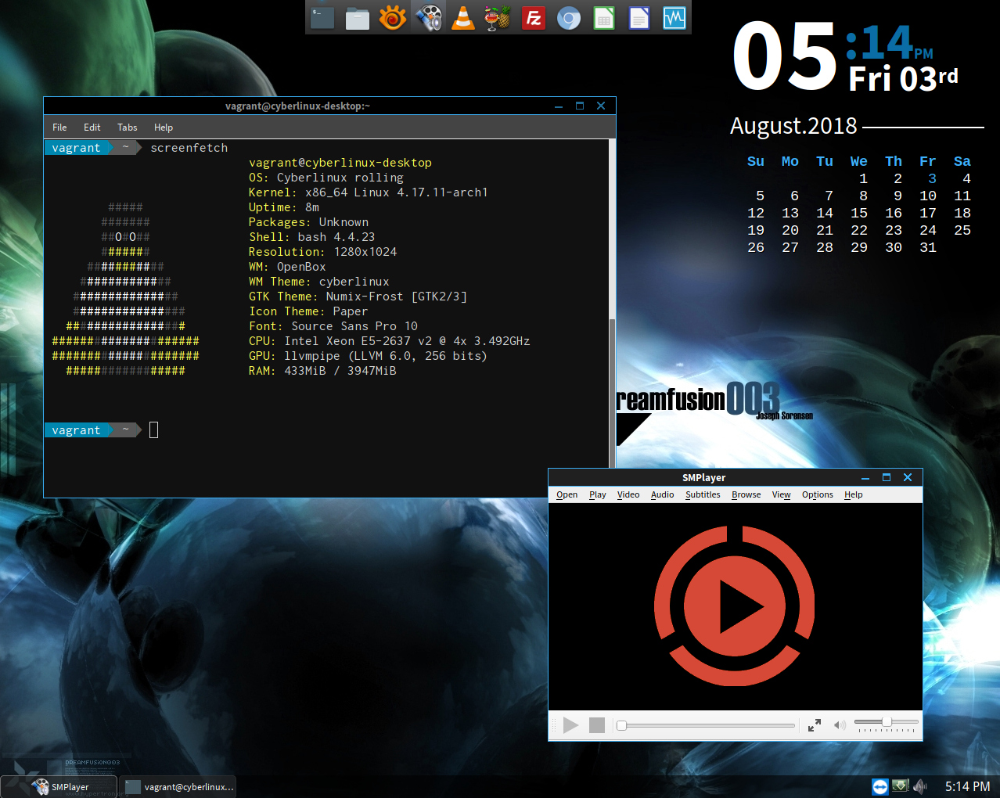

# cyberlinux

<b><i>cyberlinux</i></b> was designed to provide the unobtrusive beauty and power of Arch Linux as a fully
customized automated offline multi-deployment ISO. Using clean declarative yaml profiles,
cyberlinux is able to completely customize and automate the building of Arch Linux filesystems
which are bundled as a bootable ISO. Many common use cases are available as deployment options
right out of the box, but the option to build your own infinitely flexible deployment is yours
for the taking.

[](https://travis-ci.org/phR0ze/cyberlinux?branch=master)
[](https://coveralls.io/github/phR0ze/cyberlinux?branch=master)
[](https://opensource.org/licenses/MIT)

### Disclaimer
***cyberlinux*** comes with absolutely no guarantees or support of any kind. It is to be used at
your own risk.  Any damages, issues, losses or problems caused by the use of ***cyberlinux*** are
strictly the responsiblity of the user and not the developer/creator of ***cyberlinux***.

Additionally the pre-configured ***profiles*** and ***layers*** that exist in this repo are
purely for my own personal benefit and pull requests will be evaluated as such. I intend to make the
defaults generally useful but foremost it needs to be useful for my purposes. Pull requests aligning
with my desires will be accepted. Typically I would expect those looking to leverage this framework to
fork it and make their own configuration ***profiles***

### Table of Contents
* [cyberlinux Profiles](#cyberlinux-profiles)
    * [Standard Profile](#standard-profile)
    * [Personal Use Profile](#personal-profile)
    * [Kubernetes Profile](#kubernetes-profile)
* [Deploy cyberlinux](#deploy-cyberlinux)
    * [Bare metal deployment](#bare-metal-deployment)
    * [Virtual box deployment](#virtual-box-deployment)
    * [Vagrant box deployment](#vagrant-box-deployment)
    * [Brown field deployment](#brown-field-deployment)
* [Configure cyberlinux](#configure-cyberlinux)
    * [Enable Proxy](#enable-proxy)
    * [Disable Proxy](#disable-proxy)
* [Roll your own cyberlinux](#build-cyberlinux)
* [Arch Help](#arch-help)
    * [Certificates](#certificates)
    * [BlackArch Signature issue](#blackarch-signature-issue)
* [Background](#background)
   * [Evolution](#evolution)
   * [My take on Arch](#my-take-on-arch)
   * [Distro requirements](#distro-requirements)
* [Contributions](#contributions)
    * [Git-Hook Version Increment](#git-hook-version-increment)
* [Licenses](#licenses)

<a href="doc/images/cyberlinux-deployment.jpg"></a>

## cyberlinux Profiles <a name="cyberlinux-profiles"/></a>
There are serveral predefined profiles to choose from and the possibility of making endless.

### Standard Profile <a name="standard-profile"/></a>
The [Standard profile](profiles/standard.md) was developed carefully to exclude any applications
that were not free to use for commercial purposes.

## Personal Use Profile <a name="personal-profile"/></a>
The [Personal profile](profiles/personal.md) was developed to allow the distribution of applications
for personal use that are not allowed due to licensing restrictions for commercial use.

## Kubernetes Profile <a name="kubernetes-profile"/></a>
The [Kubernetes profile](profiles/kubernetes.md) was developed as a slimmed down shell environment
with Kubernetes dependencies baked in. It includes ***kubectl***, ***kubelet***, ***kubeadm***,
***docker*** and ***helm*** to easily and quickly setup a K8s cluster.

## Deploy cyberlinux <a name="deploy-cyberlinux"/></a>
There are a number of ways to get up and running quickly with ***cyberlinux***

### Bare metal deployment <a name="bare-metal-deployment"/></a>
Deploy ***cyberlinux*** via a USB directly onto a machine

1. Download the latest [***cyberlinux ISO***](https://github.com/phR0ze/cyberlinux/releases)
2. Burn the ISO to a USB via ***dd***  
    ```bash
    # Determine correct USB device
    sudo fdisk -l

    # Burn to USB
    sudo dd bs=4M if=~/cyberlinux-0.0.159-4.12.13-1-x86_64.iso of=/dev/sdb status=progress oflag=sync
    ```
2. Burn the ISO to a USB via ***MultiWriter***  
    ```bash
    # Install MultiWriter
    sudo pacman -S gnome-multi-writer

    # Launch MultiWriter
    sudo gnome-multi-writer

    # Add the ISO and point it at your USB and click start  
    ```
3. Burn the ISO to a DVD via ***GrowISOFS***  
    ```bash
    # Navigate to temp location
    cd ~/Projects/cyberlinux/temp

    # Burn dvd
    growisofs -dvd-compat -Z /dev/sr0=images/cyberlinux-0.1.2-4.14.11-1-x86_64.iso
    ```
4. Boot from the USB and choose the ***cyberlinux-desktop*** deployment option

### Virtual box deployment <a name="virtual-box-deployment"/></a>
Deploy ***cyberlinux*** via a VM using Virtual Box

1. Create a VM named ***cyberlinux-desktop*** with ***4GB RAM, 40GB HDD***  
2. Once created edit ***Settings***  
    a. Set ***System >Processor = 4***  
    b. Set ***Display >Video = 32***  
    c. Set ***Network >Bridged Adapter***  
    d. Set ***Storage >IDE Empty*** to ***cyberlinux-0.0.159-4.12.13-1-x86_64.iso***  
    e. Click ***OK***  
2.	Once booted to the ISO choose the ***cyberlinux-desktop*** deployment option

### Vagrant box deployment <a name="vagrant-box-deployment"/></a>
Deploy ***cyberlinux*** via a VM using a Vagrant Box

**Raw Vagrant Use**  
```bash
# Create a Vagrantfile describing the cyberlinux-desktop box to use
vagrant init phR0ze/cyberlinux-desktop --box-version 0.0.159

# Download and deploy cyberlinux-desktop box
vagrant up
```

**Vagrant with Reduce**  
```bash
# Clone cyberlinux
git clone git@github.com:phR0ze/cyberlinux.git

# Deploy cyberlinux vagrant box via reduce
cd cyberlinux
sudo ./reduce deploy desktop -p standard
```

### Brown field deployment <a name="brown-field-deployment"/></a>
Using an existing arch linux system to deploy cyberlinux is more complicated as it requires a few
dependencies. I'll be documenting them here:

* cyberlinux-grub
* ruby
* docker

## Configure cyberlinux <a name="configure-cyberlinux"/></a>
### Enable Proxy <a name="enable-proxy"/></a>
cyberlinux uses the ***/usr/bin/setproxy*** script to configure the proxy given during install for:

1. Shells via ***/etc/profile.d/setproxy.sh***
2. XWindows apps via ***/etc/dconf/db/local.d/00-proxy***
3. Docker via ***/etc/systemd/system/docker.service.d/20-proxy.conf***

Update ***/usr/bin/setproxy*** variables as shown below: 
```bash
proxy=http://proxy.corp.net:8080
proxy_host=proxy.corp.net
proxy_port=8080
no_proxy=localhost,127.0.0.1
no_proxy_aray="['localhost', '127.0.0.1']"
```
Enable proxy:
1. Run: `sudo setproxy 1`
2. Logout and back in

### Disable Proxy <a name="disable-proxy"/></a>
Disable proxy:
1. Run: `sudo setproxy 0`
2. Logout and back in

## Roll your own cyberlinux <a name="build-cyberlinux"/></a>
[See => profiles/README.md](https://github.com/phR0ze/cyberlinux/blob/master/profiles)

## Arch Help <a name="arch-help"/></a>
The [arch wiki](https://wiki.archlinux.org/) is the best place to go for help. I've just collected a
few things here that were useful for me.

### Certificates <a name="certificates"/></a>

#### Add Root CA <a name="add-root-ca"/></a>
```bash
#Download certs
wget --no-check-certificate -P ~/Downloads https://example.com/CAs/CA1.zip
# Unzip cert and rename to crt
unzip CA1.zip && rename CA1.cer CA1.crt
# Install new CA cert, original file can then be deleted
sudo trust anchor CA1.crt
```

### BlackArch Signature issue <a name="blackarch-signature-issue"/></a>
To fix the issue below delete ***/var/lib/pacman/sync/*.sig***

Example: 
```
error: blackarch: signature from "Levon 'noptrix' Kayan (BlackArch Developer) <noptrix@nullsecurity.net>" is invalid
error: failed to update blackarch (invalid or corrupted database (PGP signature))
error: database 'blackarch' is not valid (invalid or corrupted database (PGP signature))
```

## Background <a name="background"></a>
***cyberlinux*** is an evolution of an idea come to fruition.  The origin was the need for an
automated installer that would be able to install a completely pre-configured and ready to use
system customized for a handful of common use cases (e.g. desktop, theater, server...) in an offline
environment. As time passed the need for simpler maintainability and access to larger more
up-to-date software repositories drove the search for the ideal Linux distribution.

### Evolution <a name="evolution"></a>

**Ubuntu Online Install**  
In the beginning I would deploy a super lightweight Ubuntu server system and then launch a custom
python script that would automate installing all packages and configuration settings I desired on
the new system.  This unfortunately required an internet connection and that my package sources,
many of which were outside Ubuntu's repositories, persist at the same location over an extended
period of time.  This method was slow, and fraught with network failures and missing online
packages as maintainers came and went.

**CentOS Offline Install**  
My next attempt was to use CentOS and Kickstart to develop an ISO with all the packages stored on
an ISO.  This solved my offline issues and gave a consistent versioning for packages, but still
took a long time to install and didn't allow for much in the way of pre-build or post install
configuration.  Additionally CentOS is notoriously behind the times and packages are difficult to
find or simply don't exist. Additionally building newer packages on the old CentOS tool chains
proved difficult and impossible in some cases where they required newer dependencies.

**Manjaro Offline Install**  
About this time I started looking for distribution that provided modern packages and tooling and
found Arch.  Being intimidated by Arch's install process though I moved on to Manjaro as the next
best thing and fell in love with ***manjaroiso*** and ***Thus*** as the means to develop my own
offline ISO with pre/post install configuration changes.  This seemed to solve most of my problems.
I now had offline install capabilities, latest versioned packages available and the ability to make
some small pre/post install changes.  However it didn't allow for custom applications for different
deployment options without heroic effort.  As time passed I found I was making more and more changes
to ***Thus***, the installer, and other installation aspects other than what was allowed for with
Manjaro's current tool set at the time. I soon realized that I had evolved my use of Manjaro so far
beyond its original purpose that consuming updates from upstream Manjaro and other tasks were
becoming complicated and tedious.  Additionally I was more and more envious of pure Arch Linux and
the goodness that was available by staying close to the source and began looking at Arch Linux
directly.

**Arch Offline Install**  
I really like Manjaro as per above and it took me far down the road I wanted to go. I began to
discover however that the parent distro, Arch Linux, had far greater market acceptance and thus more
community repositories and more pre-built AUR packages. I quickly found that the custom AUFS kernel
and different processes that Manjaro was using meant I couldn't leverage the greater Arch Linux
community packages easily. At this point I realized that I'd already moved far beyond the original
issue I had with Arch of no installer and so it was a natural progression to switch my distribution
from Manjaro to be based directly on Arch Linux. This made BlackArch and Antergos repos directly
available and put me in a bigger support community with newer updates and packages.

### My take on Arch <a name="my-take-on-arch"></a>
***Arch Linux kills!*** I've never used a distribution as simple, clean and easy to use as Arch. The
packages are plentiful, up-to-date and easily managed. The community is huge and active, providing
almost every package known to man in the Arch User Repository or you can easily build your own
packages with little effort. The kernel and tooling is modern, maintenance is easy and rolling
updates make for a system that can be used forever with little effort. Best of all though is that
the Arch Install process provides simple building blocks that lend themselves easily to custom
filesystem creations that in turn is readily turned into ISOs and other install media. Because of
the large community and plethera of distros based off Arch there are many ideas to leverage such
as the following:

**BlackArch** - https://blackarch.org  
BlackArch is a penetration testing distro based directly off Arch and is 100% compatible with Arch.
One of the main reasons I'm moving off Manjaro to pure Arch is to get access to BlackArch's
repository of penetration testing tools.

**Manjaro** - http://manjaro.org/get-manjaro  
Manjaro is an Arch split-off distro which used to have a really nice OpenBox deployment that suited
my needs quite well.  They have since dropped the OpenBox deployment but their distribution is still
one of the best distros out there and have a great community which adds to Arch's appeal with a
little adaptation. The main draw back with Manjaro is that that it can't leverage the Arch repos as
is due to their differences.

**ArchBang** - http://bbs.archbang.org  
ArchBang caught my eye because they are devoted to using lite components like OpenBox, LXTerminal,
VolumeIcon, LXAppearance, etc... They have a great community and a lot of good ideas and
configuration for keeping your system lite.

**Antergos** - http://antergos.com  
Antergos is based on Arch and 100% compatible but also has a few developments of its own, like its
slick custom isolinux boot and installer.  They also offer a number of prebuilt AUR packages in
their custom repos.

### Distro requirements <a name="distro-requirements"></a>
I boiled down my requirements for ***cyberlinux*** as follows:

* Single configuration file (i.e. profile) to drive ISO creation
* ISO must include all packages, config etc... (i.e. works offline)
* Boot splash screen shown with multi-deployment options
* Fast, simple automated installs with abosolute minimal initial user input
* Fully pre-configured user environments to avoid post-install changes
* Live boot option for maintenance, rescue and secure work
* Hardware boot and diagnostics options e.g. RAM validation
* As light as possible while still offering an elegant solution


## Contributions <a name="contributions"/></a>
Pull requests are always welcome.  However understand that they will be evaluated purely on whether
or not the change fits with my goals/ideals for the project.

### Git-Hook Version Increment <a name="git-hook-version-increment"/></a>
Enable the githooks to have automatic version increments

```bash
cd ~/Projects/cyberlinux
git config core.hooksPath .githooks
```

<!-- 
vim: ts=2:sw=2:sts=2
-->

## Licenses <a name="licenses"/></a>
Because of the nature of ***cyberlinux*** any licensing will be of a mixed nature.  In some cases as
called out below such as ***reduce*** and the ***boot/initramfs/installer***, created by phR0ze, the
license is MIT. In other cases works i leveraged from else where using licenses such as GPLv2.

### ART works
All art works used in the distribution have been carefully selected to be either creative commons,
public domain, have permission from the original authors, or lay claim on fair use licensing. If for
some reason a licensing mistake has been made please let me know and I'll review the claim immediately.

### Reduce, build and Install Scripts
***reduce*** and all Ruby code related to it is licensed below via MIT additionally the
boot/initramfs/installer bash code base is likewise MIT licensed.

MIT License
Copyright (c) 2017-2018 phR0ze

Permission is hereby granted, free of charge, to any person obtaining a copy
of this software and associated documentation files (the "Software"), to deal
in the Software without restriction, including without limitation the rights
to use, copy, modify, merge, publish, distribute, sublicense, and/or sell
copies of the Software, and to permit persons to whom the Software is
furnished to do so, subject to the following conditions:

The above copyright notice and this permission notice shall be included in all
copies or substantial portions of the Software.

THE SOFTWARE IS PROVIDED "AS IS", WITHOUT WARRANTY OF ANY KIND, EXPRESS OR
IMPLIED, INCLUDING BUT NOT LIMITED TO THE WARRANTIES OF MERCHANTABILITY,
FITNESS FOR A PARTICULAR PURPOSE AND NONINFRINGEMENT. IN NO EVENT SHALL THE
AUTHORS OR COPYRIGHT HOLDERS BE LIABLE FOR ANY CLAIM, DAMAGES OR OTHER
LIABILITY, WHETHER IN AN ACTION OF CONTRACT, TORT OR OTHERWISE, ARISING FROM,
OUT OF OR IN CONNECTION WITH THE SOFTWARE OR THE USE OR OTHER DEALINGS IN THE
SOFTWARE.
