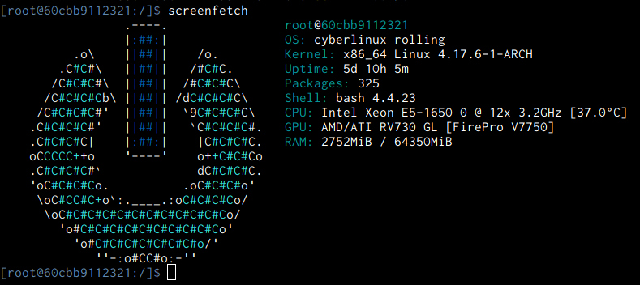

# cyberlinux containers Profile


The [containers profile](containers.md) was developed to provide docker containers for use in the
cloud world, such as deployed as an app in Kubernetes.

### Disclaimer
***cyberlinux*** comes with absolutely no guarantees or support of any kind. It is to be used at
your own risk.  Any damages, issues, losses or problems caused by the use of ***cyberlinux*** are
strictly the responsiblity of the user and not the developer/creator of ***cyberlinux***.

### Table of Contents
* [core Container](#core-container)
* [ruby Container](#ruby-container)
* [net Container](#net-container)
* [shell Container](#shell-container)

## core Container <a name="core-container"/></a>
https://hub.docker.com/r/phr0ze/cyberlinux-core/

Smallest set of packages possible for a functioning container with bash. Size: ***~53.14 MiB***
```bash
# To build run:
sudo ./reduce clean build -d core -p containers

# Deploy container to local docker
sudo ./reduce deploy core -p containers

# Run net container with docker
docker run --rm -it core-0.2.197:latest bash
```

## ruby Container <a name="ruby-container"/></a>
https://hub.docker.com/r/phr0ze/cyberlinux-ruby/

Smallest set of packages required to have a ruby container in Arch Linux. Size: ***~63.39 MiB***
```bash
# To build run:
sudo ./reduce clean build -d ruby -p containers

# Deploy container to local docker
sudo ./reduce deploy ruby -p containers

# Run net container with docker
docker run --rm -it ruby-0.2.197:latest irb
```

## net Container <a name="net-container"/></a>
https://hub.docker.com/r/phr0ze/cyberlinux-net/

Lighter container with bash and networking utilities
```bash
# To build run:
sudo ./reduce clean build -d net -p containers

# Deploy container to local docker
sudo ./reduce deploy net -p containers

# Run net container with docker
docker run --rm -it net-0.2.197:latest bash
```

## shell Container <a name="shell-container"/></a>
https://hub.docker.com/r/phr0ze/cyberlinux-shell/

Heavier bash environmetn with tooling for development in python, ruby or Go
```bash
# To build run:
sudo ./reduce clean build -d shell -p containers

# Deploy container to local docker
sudo ./reduce deploy shell -p containers

# Run net container with docker
docker run --rm -it shell-0.2.197:latest bash
```


