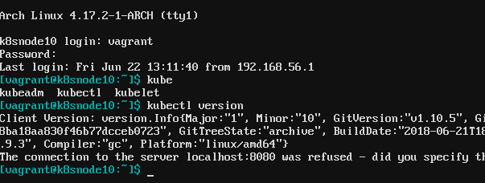

# cyberlinux k8snode Profile


The [k8snode profile](k8snode.yml) was developed as a slimmed down shell environment with
Kubernetes dependencies baked in.  It includes ***kubectl***, ***kubelet***, ***kubeadm***,
***docker*** and ***helm*** to easily and quickly setup a K8s cluster.

### Disclaimer
***cyberlinux*** comes with absolutely no guarantees or support of any kind. It is to be used at
your own risk.  Any damages, issues, losses or problems caused by the use of ***cyberlinux*** are
strictly the responsiblity of the user and not the developer/creator of ***cyberlinux***.

### Table of Contents
* [k8snode Deployment](#k8snode-deployment)

## k8snode Deployment <a name="k8snode-deployment"/></a>


```bash
# Example: deploy a k8snode with ip address of 192.168.56.10
sudo ./reduce deploy k8snode 10 -p k8snode
```
