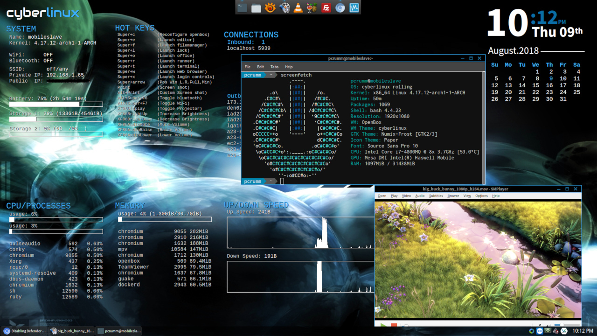
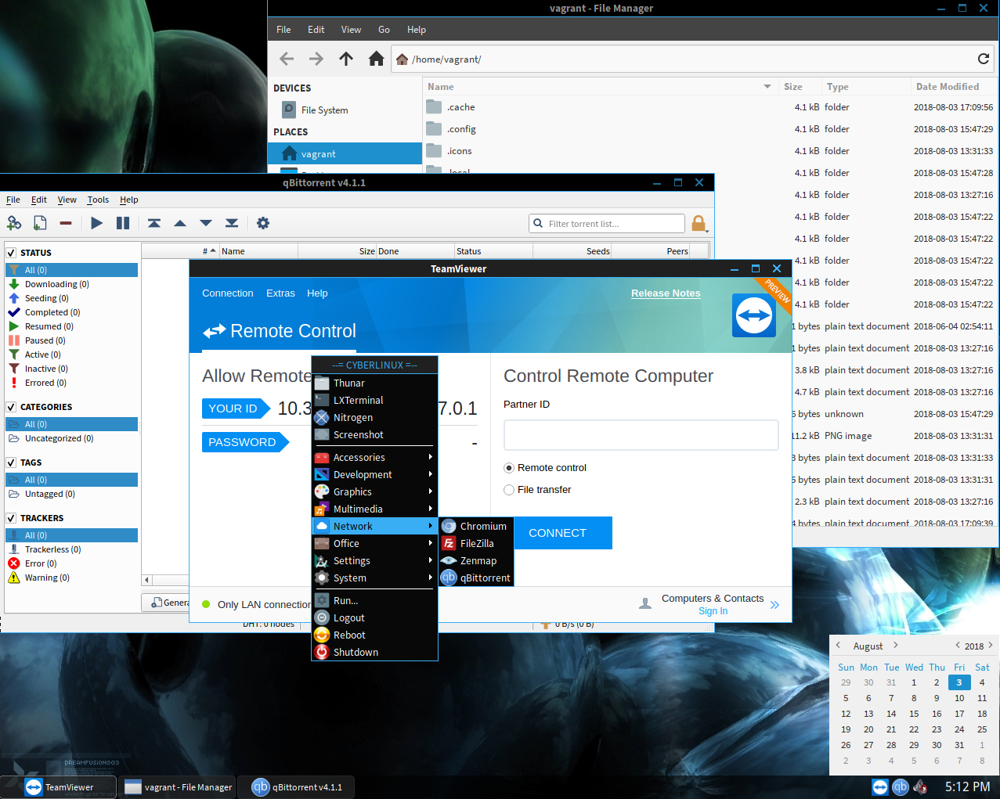
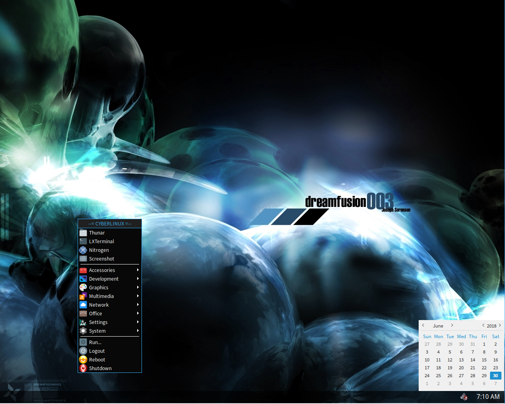
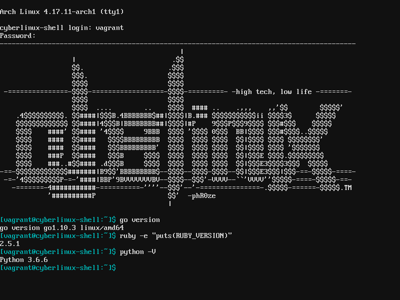

# cyberlinux Personal Use Profile

This profile uses applications with various restrictions and can not be used
for commercial purposes. It is only to be used for personal use only.

### Disclaimer
***cyberlinux*** comes with absolutely no guarantees or support of any kind. It is to be used at
your own risk.  Any damages, issues, losses or problems caused by the use of ***cyberlinux*** are
strictly the responsiblity of the user and not the developer/creator of ***cyberlinux***.

### Table of Contents
* [Build Steps](#build-steps)
* [Desktop Deployment](#desktop-deployment)
* [Desktop Deployment](#desktop-deployment)
* [Laptop Deployment](#laptop-deployment)
  * [Dell Inspiron 1545](#dell-inspiron-1545)
* [Theater Deployment](#theater-deployment)
* [Server Deployment](#server-deployment)
* [Netbook Deployment](#netbook-deployment)
* [Lite Deployment](#lite-deployment)
* [Shell Deployment](#shell-deployment)

# Build Steps <a name="build-steps"/></a>
Build the multi-deployment ISO for the personal cyberlinux profile

```bash
# Install prerequisites
$ sudo pacman -S ruby docker vagrant virtualbox

# Clone the cyberlinux repo
$ git clone git@github.com:phR0ze/cyberlinux.git

# Change directory into the newly cloned repo
$ cd cyberlinux

# Install ruby dependencies
$ bundle install --system

# Build one deployment at a time to ensure they are all working
$ sudo ./reduce clean build isofull -d shell -p personal

# Trigger full build
$ sudo ./reduce clean build isofull -p personal

# Pack all deployments as Vagrant boxes that end up in .../cyberlinux/temp/images
$ ./reduce pack
```

# Desktop Deployment <a name="desktop-deployment"/></a>
The ***desktop*** deployment was created to serve as a full developer environment and daily runner.
It is an amalgam of most other deployment options. Although it is the heaviest of the deployments,
resource wise, it is still built with speed and efficiency in mind.

**Features:** 
* Development (vscode, go, ruby, python)
* File Sharing (NFS, Torrent, SFTP, FTP)
* Productivity and Office (libreoffice, pdfs)
* Virtual Machines and Containers (virtualbox, docker)
* Media Processing/Consumption (vlc, smplayer, mvp, handbrake, makemkv)

# Laptop Deployment <a name="laptop-deployment"/></a>
The ***laptop*** deployment is essentially just the desktop deployment with a few configuration
changes useful for a laptop such as:

**Features:**
* Wireless configuration
* Backlight configuration
* Conky widgets statistics showing networking, storage, battery, cpu and ram usage and date and time

<a href="../docs/images/personal-laptop.jpg"></a>

## Dell Inspiron 1545 <a name="dell-inspiron-1545"/></a>
* 4GB RAM
* Intel Core 2 Duo CPU T6400@2.00GHz
* 512GB SSD
* Intel GM45 Graphics
* IDT 92HD71 Audio
* Dell Wireless 1397 WLAN
* Marvell Yukon 88E8040 PCI-E Fast Ethernet

# Theater Deployment <a name="theater-deployment"/></a>
Xorg desktop environment focusing on media playback

# Server Deployment <a name="server-deployment"/></a>
The ***server*** deployment was created to serve as a light weight web and file server that would
be run on lower end headless hardware. It is built on top of teh ***lite*** deployment.

**Features:** 
* Web Server
    * Apache, PHP
* Telephony Engine
    * Asterisk
* File Sharing
    * NFS, Torrent, SFTP, FTP
* Media Processing
    * Handbrake, makemkv-cli

<a href="../docs/images/server-deployment.jpg"></a>

# Netbook Deployment <a name="netbook-deployment"/></a>
The ***netbook*** deployment builds on the lite deployment by adding the following features.

**Features:**
* Wireless configuration
* Backlight configuration
* Teaviewer remoting
* Conky widgets statistics showing networking, storage, battery, cpu and ram usage and date and time

# Lite Deployment <a name="lite-deployment"/></a>
Slimmed down minimal Xorg desktop environment with selected light weight apps built on top of the
***Shell*** deployment.

**Features:**
* System
    * LXDM, OpenBox, Nitrogen, Thunar, Tint1
* Utilities
    * Galculater, GSimpleCal, File Roller, LXRandr, LXTerminal, PNMixer, PAVUControl, Xfce3 Screenshooter
* Nework
    * Chromium, Filezilla
* Media
    * Audacious, GPicView, SMPlayer, VLC, WinFF, XNViewMP
* Office
    * Evince, GVim, Leafpad

<a href="../docs/images/lite-deployment.jpg"></a>

# Shell Deployment <a name="shell-deployment"/></a>
Intended as a full shell development environment the ***Shell*** deployment provides:

**Features:**
* Filesystem utilities
    * dosfstools, efibootmgr, gptfdisk, cdrkit, pkgfile, squashfs-tools
* Compression utilities
    * p6zip, tar, unrar, unzip, zip
* Networking utilities
    * curl, dnsutils, wget, rsync
* Development utilities
    * C, C++, Go, Ruby, Python
* System utilities
    * htop, iftop

<a href="../docs/images/shell-deployment.png"></a>
