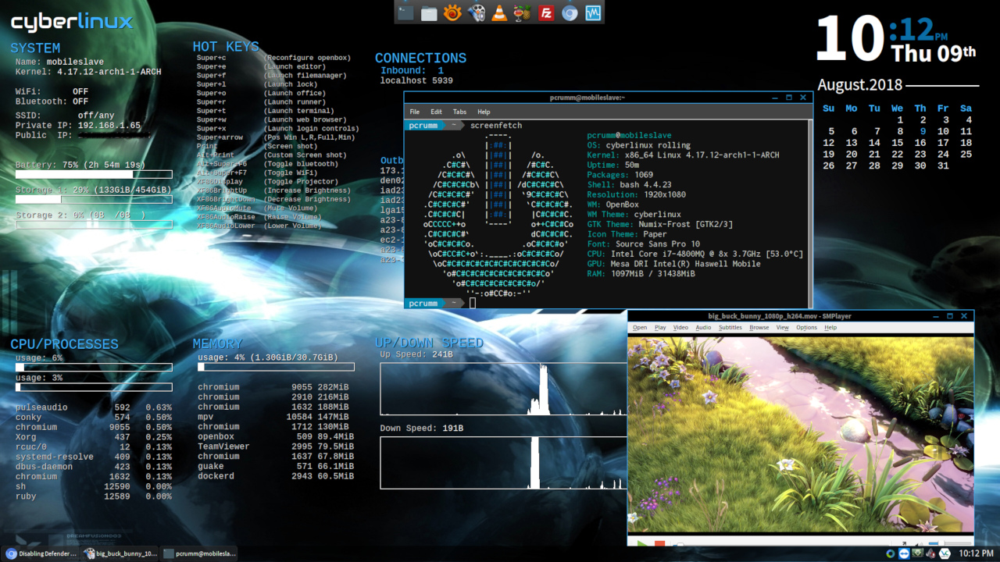
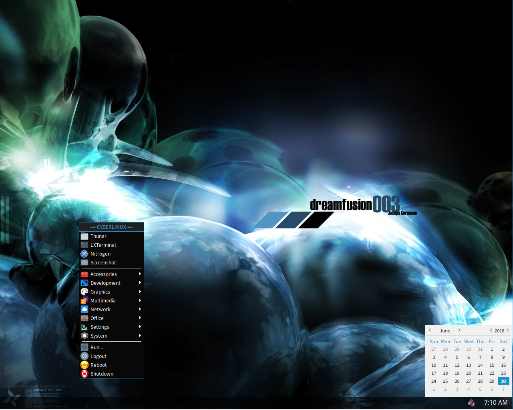
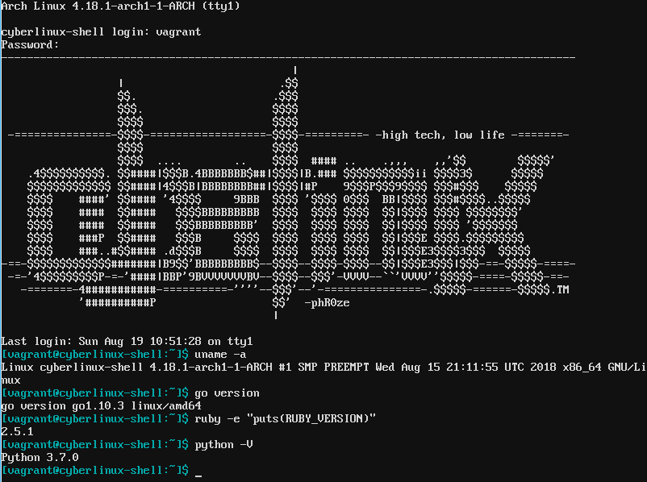

# cyberlinux Standard Profile

The [Standard profile](standard.yml) was developed carefully to exclude any applications
that were not free to use for commercial purposes.

### Disclaimer
***cyberlinux*** comes with absolutely no guarantees or support of any kind. It is to be used at
your own risk.  Any damages, issues, losses or problems caused by the use of ***cyberlinux*** are
strictly the responsiblity of the user and not the developer/creator of ***cyberlinux***.

### Table of Contents
* [Desktop Deployment](#desktop-deployment)
* [Lite Deployment](#lite-deployment)
* [Shell Deployment](#shell-deployment)

### Desktop Deployment 
The ***desktop*** deployment was created to serve as a full developer environment and daily runner.
It is an amalgam of most other deployment options. Although it is the heaviest of the deployments,
resource wise, it is still built with speed and efficiency in mind. It is built on top of the
***Lite*** deployment thus having all the new features below layered on top of the existing Lite
applications and configuration.

**Features:** 
* System
  * WPA Supplicant, guake, plank
* Utilities
  * Android Utils, Docker, VirtualBox, Cinnamon ScreenSaver, Conky
* Nework
  * Synergy
* Media
  * Gimp, SMplayer, Mvp, Handbrake, MakeMKV, Audacity, Brasero, DEVEDE, Avidemux, OpenShot,
  InkScape, Scribus, Asunder, Tiny Media Manager
* Office
  * LibreOffice, PDFMod
* Development
  * Visual Studio Code, Meld

### Lite Deployment 
Slimmed down minimal Xorg desktop environment with selected light weight apps built on top of the
***Shell*** deployment thus having all the new features below layered on top of the existing shell
applications and configuration.

**Features:**
* System
    * LXDM, OpenBox, Nitrogen, Thunar, Tint1
* Utilities
    * Galculater, GSimpleCal, File Roller, LXRandr, LXTerminal, PNMixer, PAVUControl, Xfce3 Screenshooter
* Nework
    * Chromium, FileZilla
* Media
    * Audacious, GPicView, SMPlayer, VLC, WinFF, XNViewMP
* Office
    * Evince, GVim, Leafpad

### Shell Deployment 
Intended as a full shell development environment the ***Shell*** deployment provides:

**Features:**
* Filesystem utilities
    * dosfstools, efibootmgr, gptfdisk, cdrkit, pkgfile, squashfs-tools
* Compression utilities
    * p6zip, tar, unrar, unzip, zip
* Networking utilities
    * curl, dnsutils, wget, rsync
* Development utilities
    * C, C++, Go, Ruby, Python
* System utilities
    * htop, iftop
