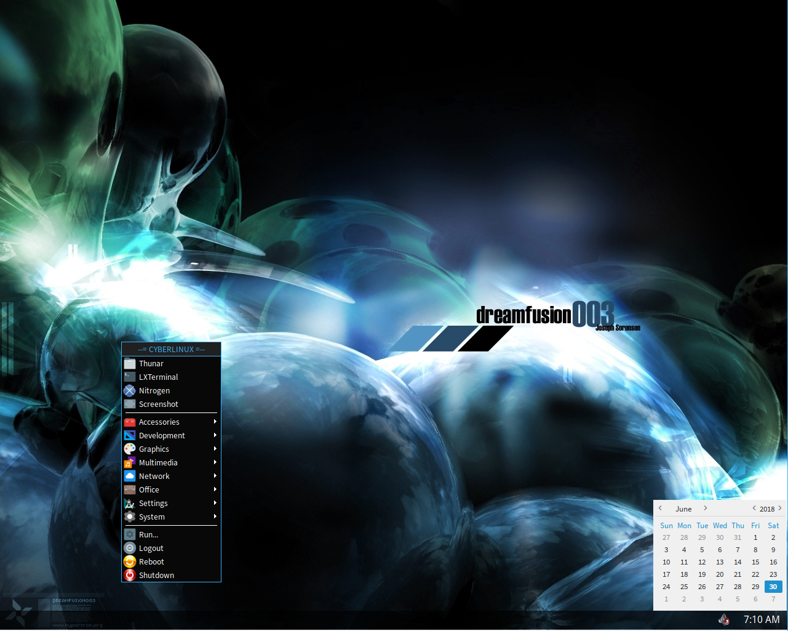
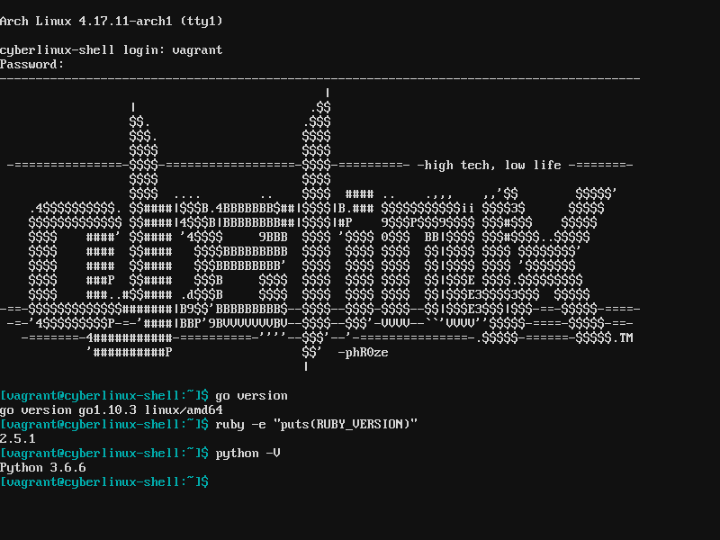

# cyberlinux Standard Profile

The [Standard profile](standard.yml) was developed carefully to exclude any applications
that were not free to use for commercial purposes.

### Disclaimer
***cyberlinux*** comes with absolutely no guarantees or support of any kind. It is to be used at
your own risk.  Any damages, issues, losses or problems caused by the use of ***cyberlinux*** are
strictly the responsiblity of the user and not the developer/creator of ***cyberlinux***.

### Table of Contents
* [Desktop Deployment](#desktop-deployment)
* [Theater Deployment](#theater-deployment)
* [Lite Deployment](#lite-deployment)
* [Shell Deployment](#shell-deployment)

### Desktop Deployment 
The ***desktop*** deployment was created to serve as a full developer environment and daily runner.
It is an amalgam of most other deployment options. Although it is the heaviest of the deployments,
resource wise, it is still built with speed and efficiency in mind.

**Features:** 
* Development (vscode, go, ruby, python)
* File Sharing (NFS, Torrent, SFTP, FTP)
* Productivity and Office (libreoffice, pdfs)
* Virtual Machines and Containers (virtualbox, docker)
* Media Processing/Consumption (vlc, smplayer, mvp, handbrake, makemkv)

### Theater Deployment 
Xorg desktop environment focusing on media playback

### Lite Deployment 
Slimmed down minimal Xorg desktop environment with selected light weight apps built on top of the
***Shell*** deployment.

**Features:**
* System
    * LXDM, OpenBox, Nitrogen, Thunar, Tint1
* Utilities
    * Galculater, GSimpleCal, File Roller, LXRandr, LXTerminal, PNMixer, PAVUControl, Xfce3 Screenshooter
* Nework
    * Chromium, Filezilla
* Media
    * Audacious, GPicView, SMPlayer, VLC, WinFF, XNViewMP
* Office
    * Evince, GVim, Leafpad

### Shell Deployment 
Intended as a full shell development environment the ***Shell*** deployment provides:

**Features:**
* Filesystem utilities
    * dosfstools, efibootmgr, gptfdisk, cdrkit, pkgfile, squashfs-tools
* Compression utilities
    * p6zip, tar, unrar, unzip, zip
* Networking utilities
    * curl, dnsutils, wget, rsync
* Development utilities
    * C, C++, Go, Ruby, Python
* System utilities
    * htop, iftop

